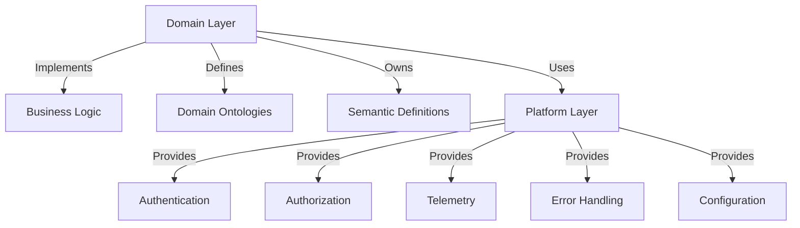

# 🏗️ Architecture Principles

The MCP Platform Framework is built on a set of core principles that ensure scalability, security, and maintainability across the enterprise. These principles guide all design decisions and implementation patterns.

## 🎯 Core Principles

### 1. **Domain Ownership** ⭐

**"Domains own business capabilities; the platform owns everything else."**

This is the foundational principle that prevents the MCP ecosystem from becoming the next generation of enterprise integration sprawl.

- **Domain Responsibilities**:
  - Business logic implementation
  - Domain-specific ontologies and vocabularies
  - Semantic definitions and business metrics
  - Domain-specific validation rules

- **Platform Responsibilities**:
  - Authentication and authorization
  - Telemetry and monitoring
  - Error handling and logging
  - Configuration management
  - Security controls
  - Deployment infrastructure



### 2. **Separation of Concerns** ⭐

Each module in the framework has a single, well-defined responsibility. This ensures:

- **Loose Coupling**: Modules can be updated independently
- **High Cohesion**: Related functionality stays together
- **Testability**: Modules can be tested in isolation
- **Maintainability**: Clear boundaries reduce complexity

### 3. **Zero-Trust Security** 🔒

Every interaction must be authenticated, authorized, and audited.

- **Never Trust, Always Verify**: All requests require authentication
- **Least Privilege**: Minimum permissions required for each operation
- **Defense in Depth**: Multiple layers of security controls
- **Immutable Audit**: All sensitive operations are logged immutably

### 4. **Observability First** ⚡

Telemetry is not an afterthought—it's a core requirement.

- **Automatic Instrumentation**: Every tool call generates telemetry
- **Standardized Metrics**: Consistent format across all domains
- **Context Propagation**: Request context flows through all layers
- **Performance Monitoring**: Duration, status, and resource usage tracked

### 5. **Configuration as Code** 📋

All configuration is externalized and version-controlled.

- **Environment Awareness**: Different configurations for DEV, TEST, PROD
- **Secret Management**: No credentials in code, all through Key Vault
- **Validation**: Configuration is validated at startup
- **Auditability**: Configuration changes are tracked

## 🏛️ Design Patterns

### Decorator Pattern

Used extensively for cross-cutting concerns:

```python
# Authentication decorator
@authenticated_tool
def get_donor_pipeline():
    # Domain logic here
    pass

# Authorization decorator  
@requires_permission("donor.read")
def get_donor_data():
    # Domain logic here
    pass

# Classification decorator
@classification("CONFIDENTIAL")
def get_financial_reports():
    # Domain logic here
    pass

# Combined decorators
@classification("CONFIDENTIAL")
@requires_permission("finance.read")
@authenticated_tool
def get_budget_analysis():
    # Domain logic here
    pass
```

### Dependency Injection

All external dependencies are injected, not hardcoded:

```python
# Good - Dependency injected
class DonorService:
    def __init__(self, semantic_model: SemanticModel, 
                 telemetry: TelemetryClient, 
                 auth: AuthService):
        self.semantic_model = semantic_model
        self.telemetry = telemetry
        self.auth = auth

# Bad - Hardcoded dependencies
class DonorService:
    def __init__(self):
        self.semantic_model = SemanticModel()  # Hardcoded
        self.telemetry = TelemetryClient()     # Hardcoded
```

### Factory Pattern

Used for creating complex objects with consistent configuration:

```python
# Fabric connector factory
fabric_connector = FabricConnectorFactory.create(
    environment=config.environment,
    credentials=keyvault.get_secret("fabric-credentials")
)

# Semantic model factory
semantic_model = SemanticModelFactory.create(
    model_name="DonorManagement",
    connector=fabric_connector
)
```

## 📊 Architecture Decision Records (ADRs)

All significant architectural decisions are documented as ADRs in the `docs/adr/` directory.

### ADR Template

```markdown
# ADR-001: Use Decorators for Cross-Cutting Concerns

## Status
✅ Accepted

## Context
We need a consistent way to apply cross-cutting concerns (auth, telemetry, etc.) 
to domain tools without polluting domain logic.

## Decision
Use Python decorators to wrap domain functions with cross-cutting functionality.

## Consequences
- ✅ Clean separation of concerns
- ✅ Consistent application of cross-cutting concerns
- ✅ Easy to add/remove concerns
- ⚠️ Slight performance overhead (negligible)
- ⚠️ Decorator order matters

## Alternatives Considered
1. AOP frameworks - Too complex for Python
2. Base classes - Less flexible, harder to combine
3. Manual wrapping - Error-prone, inconsistent
```

### Current ADRs

| ADR | Title | Status | Date |
|-----|-------|--------|------|
| ADR-001 | Use Decorators for Cross-Cutting Concerns | ✅ Accepted | 2026-01-15 |
| ADR-002 | Azure Function App for MCP Deployment | ✅ Accepted | 2026-01-16 |
| ADR-003 | Semantic Models over Direct Table Access | ✅ Accepted | 2026-01-17 |
| ADR-004 | Centralized Configuration with Key Vault | ✅ Accepted | 2026-01-18 |
| ADR-005 | Automatic Tool Discovery and Registration | ✅ Accepted | 2026-01-19 |

## 🔄 Evolution Principles

### Backward Compatibility

- All changes must be backward compatible within major versions
- Deprecation warnings for breaking changes
- Migration guides for major version upgrades

### Technology Radar

| Category | Technologies | Status |
|----------|--------------|--------|
| **Adopt** | Azure Functions, Python 3.11+, MCP Protocol | ✅ |
| **Trial** | Azure Container Apps, FastAPI | 🔄 |
| **Assess** | Dapr, Azure Workflows | 🔍 |
| **Hold** | Azure Logic Apps, WebJobs | ⏸️ |

### Technical Debt Management

- **Tracking**: All technical debt is tracked in GitHub issues
- **Prioritization**: Debt is prioritized based on risk and impact
- **Allocation**: 20% of development time allocated to debt reduction
- **Definition of Done**: No known critical debt in production

## 📚 References

- [Microsoft Cloud Adoption Framework](https://learn.microsoft.com/en-us/azure/cloud-adoption-framework/)
- [Well-Architected Framework](https://learn.microsoft.com/en-us/azure/architecture/framework/)
- [MCP Protocol Specification](https://github.com/modelcontextprotocol/specification)
- [Azure Well-Architected Review](https://learn.microsoft.com/en-us/assessments/?mode=pre-assessment&session=default)

---

## 🎓 Best Practices Checklist

- [ ] **Domain Separation**: Domain code contains only business logic
- [ ] **Platform Usage**: All cross-cutting concerns use platform modules
- [ ] **Security First**: Authentication, authorization, and audit are implemented
- [ ] **Observability**: Telemetry is automatically captured for all operations
- [ ] **Configuration**: All settings are externalized and validated
- [ ] **Error Handling**: Consistent error structures and handling
- [ ] **Testing**: Unit, integration, and security tests are in place
- [ ] **Documentation**: Code is documented and examples are provided

*⭐ = Best Practice | 🔒 = Security Requirement | ⚡ = Performance Consideration*