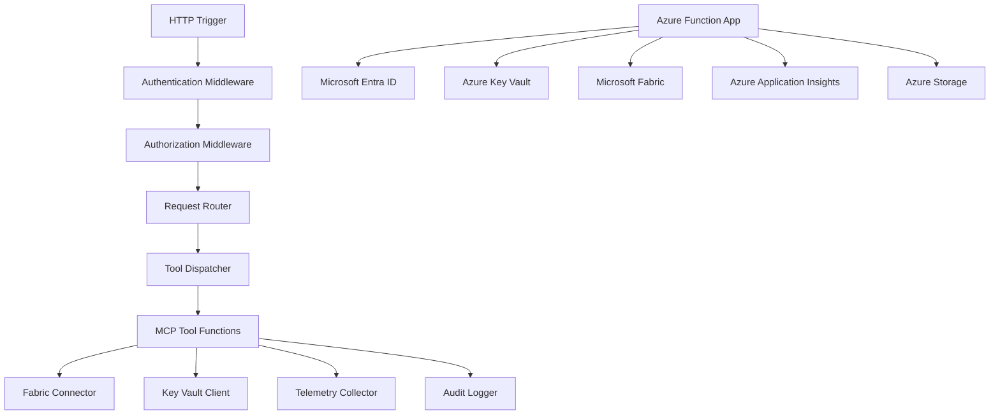

# Azure Function App Deployment Guide

## 🎯 Overview

This guide provides detailed instructions for deploying MCP Platform Framework tools to Azure Function Apps. It covers all aspects of Function App configuration, optimization, and management specifically tailored for MCP workloads.

---

## 🏗️ Function App Architecture for MCP

### MCP-Specific Architecture



### Key Components

1. **HTTP Triggers**: Entry points for MCP tool invocations
2. **Middleware**: Authentication, authorization, telemetry, and audit logging
3. **Tool Dispatcher**: Routes requests to appropriate tool functions
4. **Connectors**: Fabric, Key Vault, and other Azure service integrations
5. **Monitoring**: Application Insights integration for observability

---

## 🚀 Function App Setup

### Step 1: Create Function App

#### Using Azure CLI

```bash
# Set variables
RESOURCE_GROUP="mcp-prod-rg"
LOCATION="eastus"
STORAGE_ACCOUNT="mcpstorageprod"
FUNCTION_APP="mcp-func-prod"
APP_INSIGHTS="mcp-appinsights-prod"

# Create resource group
az group create --name $RESOURCE_GROUP --location $LOCATION

# Create storage account (required for Function App)
az storage account create \
    --name $STORAGE_ACCOUNT \
    --resource-group $RESOURCE_GROUP \
    --location $LOCATION \
    --sku Standard_LRS \
    --kind StorageV2 \
    --enable-hierarchical-namespace false

# Create Application Insights
az monitor app-insights create \
    --name $APP_INSIGHTS \
    --resource-group $RESOURCE_GROUP \
    --location $LOCATION \
    --application-type web \
    --workspace $RESOURCE_GROUP

# Create Function App (Consumption Plan - Recommended)
az functionapp create \
    --name $FUNCTION_APP \
    --resource-group $RESOURCE_GROUP \
    --consumption-plan-location $LOCATION \
    --runtime python \
    --runtime-version 3.11 \
    --functions-version 4 \
    --storage-account $STORAGE_ACCOUNT \
    --os-type Linux \
    --disable-application-insights false \
    --app-insights-name $APP_INSIGHTS \
    --startup-command "gunicorn --bind :$PORT --workers 1 --threads 8 --timeout 0 main:app"
```

#### Using Azure Portal

1. Navigate to **Function App** service in Azure Portal
2. Click **Create**
3. Select your subscription and resource group
4. Enter Function App name
5. Select **Python** as runtime
6. Select **3.11** as version
7. Select **Consumption (Serverless)** as hosting plan
8. Select **Linux** as operating system
9. Select region
10. Configure storage account
11. Enable Application Insights
12. Review and create

---

## ⚙️ Function App Configuration

### Application Settings

#### Required Settings

```bash
# Set required application settings
az functionapp config appsettings set \
    --name $FUNCTION_APP \
    --resource-group $RESOURCE_GROUP \
    --settings \
        "FUNCTIONS_WORKER_RUNTIME=python" \
        "FUNCTIONS_EXTENSION_VERSION=~4" \
        "PYTHON_VERSION=3.11" \
        "AzureWebJobsStorage=$(az storage account show-connection-string --name $STORAGE_ACCOUNT --resource-group $RESOURCE_GROUP --query connectionString --output tsv)" \
        "APPINSIGHTS_INSTRUMENTATIONKEY=$(az monitor app-insights show --name $APP_INSIGHTS --resource-group $RESOURCE_GROUP --query instrumentationKey --output tsv)"
```

#### MCP Framework Settings

```bash
# Set MCP-specific settings
az functionapp config appsettings set \
    --name $FUNCTION_APP \
    --resource-group $RESOURCE_GROUP \
    --settings \
        "MCP_ENVIRONMENT=prod" \
        "MCP_DOMAIN=DonorManagement" \
        "MCP_VERSION=1.0.0" \
        "MCP_CATALOG_ENDPOINT=https://catalog.unhcr.org/api/v1" \
        "MCP_TELEMETRY_ENABLED=true" \
        "MCP_AUDIT_ENABLED=true" \
        "MCP_DEBUG=false"
```

#### Fabric Integration Settings

```bash
# Set Fabric-specific settings
az functionapp config appsettings set \
    --name $FUNCTION_APP \
    --resource-group $RESOURCE_GROUP \
    --settings \
        "FABRIC_ENDPOINT=https://api.fabric.microsoft.com" \
        "FABRIC_WORKSPACE=PROD" \
        "FABRIC_TENANT_ID=$(az account show --query tenantId --output tsv)"
```

#### Security Settings

```bash
# Set security settings
az functionapp config appsettings set \
    --name $FUNCTION_APP \
    --resource-group $RESOURCE_GROUP \
    --settings \
        "WEBSITE_CONTENTOVERWRITE=1" \
        "WEBSITE_RUN_FROM_PACKAGE=1" \
        "WEBSITE_ENABLE_APP_SERVICE_DIAGNOSTIC=true" \
        "WEBSITE_HEALTH_CHECK_EVOLVED=1" \
        "HEALTH_CHECK_PATH=/api/health"
```

### Connection Strings

```bash
# Set connection strings
az functionapp config connection-string set \
    --name $FUNCTION_APP \
    --resource-group $RESOURCE_GROUP \
    --settings \
        "AzureWebJobsStorage=$(az storage account show-connection-string --name $STORAGE_ACCOUNT --resource-group $RESOURCE_GROUP --query connectionString --output tsv)" \
        "WEBSITE_CONTENTAZUREFILECONNECTIONSTRING=$(az storage account show-connection-string --name $STORAGE_ACCOUNT --resource-group $RESOURCE_GROUP --query connectionString --output tsv)" \
        "WEBSITE_CONTENTSHARE=mcp-content-share"
```

---

## 📁 Project Structure for Function App

### Recommended Structure

```
mcp-donor-management/
├── .github/
│   └── workflows/
│       └── deploy.yml
├── .vscode/
│   └── settings.json
├── config/
│   ├── default.yaml
│   ├── dev.yaml
│   ├── prod.yaml
│   └── secrets/
│       └── prod.env
├── platform_framework/
│   ├── __init__.py
│   ├── auth/
│   ├── catalog/
│   ├── fabric/
│   ├── telemetry/
│   └── ...
├── tools/
│   ├── __init__.py
│   ├── donor_management.py
│   └── ...
├── tests/
│   ├── __init__.py
│   ├── test_tools.py
│   └── ...
├── templates/
│   └── docs/
│       └── tool.md.j2
├── .gitignore
├── host.json
├── local.settings.json
├── main.py
├── requirements.txt
└── function.json
```

### host.json Configuration

```json
{
  "version": "2.0",
  "logging": {
    "applicationInsights": {
      "samplingSettings": {
        "isEnabled": true,
        "excludedTypes": "Request"
      }
    }
  },
  "extensionBundle": {
    "id": "Microsoft.Azure.Functions.ExtensionBundle",
    "version": "[4.*, 5.0.0)"
  },
  "functionTimeout": "00:10:00",
  "extensions": {
    "http": {
      "maxConcurrentRequests": 100,
      "maxOutstandingRequests": 200,
      "dynamicThrottlesEnabled": true
    }
  }
}
```

### local.settings.json (Development)

```json
{
  "IsEncrypted": false,
  "Values": {
    "FUNCTIONS_WORKER_RUNTIME": "python",
    "FUNCTIONS_EXTENSION_VERSION": "~4",
    "AzureWebJobsStorage": "UseDevelopmentStorage=true",
    "APPINSIGHTS_INSTRUMENTATIONKEY": "00000000-0000-0000-0000-000000000000",
    "MCP_ENVIRONMENT": "dev",
    "MCP_DOMAIN": "DonorManagement",
    "MCP_DEBUG": "true",
    "FABRIC_ENDPOINT": "https://api.fabric.microsoft.com",
    "FABRIC_WORKSPACE": "DEV",
    "CATALOG_ENDPOINT": "http://localhost:8000/api/v1"
  }
}
```

### main.py (Entry Point)

```python
import azure.functions as func
import logging
from platform.framework import initialize_framework, create_app

# Initialize logging
logging.basicConfig(level=logging.INFO)
logger = logging.getLogger(__name__)

# Initialize MCP framework
app = create_app()

# Health check endpoint
@app.route(route="health", methods=["GET"])
@app.function_name("health_check")
def health_check(req: func.HttpRequest) -> func.HttpResponse:
    """Health check endpoint for monitoring"""
    try:
        # Check framework initialization
        framework_status = initialize_framework()
        
        # Check all dependencies
        dependencies = {
            "fabric": check_fabric_connection(),
            "key_vault": check_key_vault_connection(),
            "catalog": check_catalog_connection()
        }
        
        health_status = {
            "status": "healthy",
            "framework": framework_status,
            "dependencies": dependencies,
            "timestamp": datetime.utcnow().isoformat()
        }
        
        return func.HttpResponse(
            str(json.dumps(health_status)),
            status_code=200,
            mimetype="application/json"
        )
    except Exception as e:
        logger.error(f"Health check failed: {str(e)}")
        return func.HttpResponse(
            json.dumps({"status": "unhealthy", "error": str(e)}),
            status_code=500,
            mimetype="application/json"
        )

# Import all tool modules to register them
from tools import donor_management  # noqa: F401

# Run the app
if __name__ == "__main__":
    app.run()
```

---

## 🔧 Function Configuration

### HTTP Trigger Configuration

```python
import azure.functions as func
from platform.auth import authenticated_tool
from platform.telemetry import instrumented
from platform.catalog import Classification

@app.route(route="tools/GetDonorPortfolioHealth", methods=["POST"])
@app.function_name("GetDonorPortfolioHealth")
@authenticated_tool
@instrumented
@tool(
    name="GetDonorPortfolioHealth",
    description="Retrieves comprehensive health metrics for donor portfolios",
    classification=Classification.CONFIDENTIAL,
    sla_tier="Gold",
    owner="DER",
    domain="DonorManagement"
)
def get_donor_portfolio_health(req: func.HttpRequest) -> func.HttpResponse:
    """HTTP trigger for GetDonorPortfolioHealth tool"""
    try:
        # Parse request
        request_data = req.get_json()
        donor_id = request_data.get("donor_id")
        time_range = request_data.get("time_range", "30d")
        
        # Validate input
        if not donor_id:
            return func.HttpResponse(
                json.dumps({"error": "donor_id is required"}),
                status_code=400,
                mimetype="application/json"
            )
        
        # Call tool implementation
        result = donor_management.get_donor_portfolio_health(
            donor_id=donor_id,
            time_range=time_range
        )
        
        # Return success response
        return func.HttpResponse(
            json.dumps(result),
            status_code=200,
            mimetype="application/json"
        )
        
    except Exception as e:
        # Handle errors
        error_response = {
            "error": str(e),
            "error_code": getattr(e, "code", "UNKNOWN"),
            "timestamp": datetime.utcnow().isoformat()
        }
        return func.HttpResponse(
            json.dumps(error_response),
            status_code=500,
            mimetype="application/json"
        )
```

### Timer Trigger Configuration (for background tasks)

```python
@app.timer_trigger(
    arg_name="mytimer",
    schedule="0 0 * * * *",  # Every hour
    run_on_startup=True
)
@app.function_name("CleanupOldData")
@instrumented
def cleanup_old_data(mytimer: func.TimerRequest) -> None:
    """Timer trigger for cleanup tasks"""
    try:
        # Initialize framework
        initialize_framework()
        
        # Perform cleanup
        cleanup_result = perform_cleanup()
        
        logging.info(f"Cleanup completed: {cleanup_result}")
        
    except Exception as e:
        logging.error(f"Cleanup failed: {str(e)}")
        raise
```

---

## 📊 Performance Optimization

### Cold Start Mitigation

#### Pre-warming Strategy

```python
# Warm-up endpoint
@app.route(route="warmup", methods=["GET"])
@app.function_name("warmup")
def warmup(req: func.HttpRequest) -> func.HttpResponse:
    """Warm-up endpoint to prevent cold starts"""
    try:
        # Initialize all modules
        from platform.framework import initialize_framework
        from platform.fabric import FabricClient
        from platform.catalog import CatalogClient
        
        initialize_framework()
        
        # Create clients to warm up connections
        fabric_client = FabricClient()
        catalog_client = CatalogClient()
        
        # Test connections
        fabric_client.test_connection()
        catalog_client.test_connection()
        
        return func.HttpResponse("Warm-up complete", status_code=200)
        
    except Exception as e:
        return func.HttpResponse(
            f"Warm-up failed: {str(e)}",
            status_code=500
        )

# Timer-triggered warm-up
@app.timer_trigger(
    arg_name="mytimer",
    schedule="0 */5 * * * *",  # Every 5 minutes
    run_on_startup=True
)
@app.function_name("warmup_timer")
def warmup_timer(mytimer: func.TimerRequest) -> None:
    """Timer-triggered warm-up"""
    import requests
    
    # Call warm-up endpoint
    warmup_url = "https://your-function-app.azurewebsites.net/api/warmup"
    
    try:
        response = requests.get(warmup_url, timeout=30)
        if response.status_code != 200:
            logging.warning(f"Warm-up failed: {response.status_code}")
    except Exception as e:
        logging.error(f"Warm-up request failed: {str(e)}")
```

#### Minimum Instances (Premium Plan)

```bash
# Set minimum instances for Premium Plan
az functionapp config set \
    --name $FUNCTION_APP \
    --resource-group $RESOURCE_GROUP \
    --min-instances 1 \
    --premium-plan
```

### Memory Optimization

```python
import gc
import sys

def optimize_memory():
    """Clean up memory usage"""
    # Remove unused modules
    modules_to_remove = [
        mod for mod in sys.modules 
        if mod.startswith('platform.') or mod.startswith('azure.')
    ]
    
    for mod in modules_to_remove:
        if mod in sys.modules:
            del sys.modules[mod]
    
    # Run garbage collection
    gc.collect()

# Call in long-running functions
@app.route(route="tools/LongRunningTool")
def long_running_tool(req: func.HttpRequest) -> func.HttpResponse:
    try:
        # Do work
        result = perform_long_running_task()
        
        # Clean up memory
        optimize_memory()
        
        return func.HttpResponse(json.dumps(result), status_code=200)
        
    except Exception as e:
        optimize_memory()
        return func.HttpResponse(
            json.dumps({"error": str(e)}),
            status_code=500
        )
```

### Connection Pooling

```python
from platform.fabric import FabricClient
from platform.keyvault import KeyVaultClient

# Create singleton clients
_fabric_client = None
_keyvault_client = None

def get_fabric_client():
    global _fabric_client
    if _fabric_client is None:
        _fabric_client = FabricClient()
    return _fabric_client

def get_keyvault_client():
    global _keyvault_client
    if _keyvault_client is None:
        _keyvault_client = KeyVaultClient()
    return _keyvault_client

# Use in functions
@app.route(route="tools/GetData")
def get_data(req: func.HttpRequest) -> func.HttpResponse:
    fabric_client = get_fabric_client()
    keyvault_client = get_keyvault_client()
    
    # Use clients
    data = fabric_client.get_data()
    secret = keyvault_client.get_secret("my-secret")
    
    return func.HttpResponse(json.dumps(data), status_code=200)
```

---

## 🔒 Security Configuration

### Authentication Configuration

```python
from platform.auth import AuthConfig, AuthenticationModule

# Configure authentication
auth_config = AuthConfig(
    entra_id_tenant_id=os.getenv("AZURE_TENANT_ID"),
    entra_id_client_id=os.getenv("AZURE_CLIENT_ID"),
    entra_id_client_secret=os.getenv("AZURE_CLIENT_SECRET"),
    allowed_audiences=["api://mcp.unhcr.org"],
    allowed_issuers=[f"https://login.microsoftonline.com/{os.getenv('AZURE_TENANT_ID')}/v2.0"]
)

auth_module = AuthenticationModule(config=auth_config)

# Use in middleware
@app.route(route="tools/{tool_name}")
def tool_handler(req: func.HttpRequest, tool_name: str) -> func.HttpResponse:
    # Authenticate request
    try:
        caller = auth_module.authenticate_request(req)
        req.context.caller = caller
    except AuthenticationError as e:
        return func.HttpResponse(
            json.dumps({"error": "Authentication failed", "details": str(e)}),
            status_code=401
        )
    
    # Continue with tool execution
    # ...
```

### CORS Configuration

```python
# Configure CORS in Function App
az functionapp cors add \
    --name $FUNCTION_APP \
    --resource-group $RESOURCE_GROUP \
    --allowed-origins "https://unhcr.org" "https://portal.unhcr.org" "https://localhost:3000"

az functionapp cors add \
    --name $FUNCTION_APP \
    --resource-group $RESOURCE_GROUP \
    --allowed-methods GET POST OPTIONS

az functionapp cors add \
    --name $FUNCTION_APP \
    --resource-group $RESOURCE_GROUP \
    --allowed-headers "Content-Type" "Authorization" "X-Request-ID"
```

### HTTPS Configuration

```bash
# Enforce HTTPS
az functionapp config set \
    --name $FUNCTION_APP \
    --resource-group $RESOURCE_GROUP \
    --https-only true

# Configure TLS version
az functionapp config set \
    --name $FUNCTION_APP \
    --resource-group $RESOURCE_GROUP \
    --min-tls-version 1.2
```

---

## 📈 Monitoring and Diagnostics

### Application Insights Integration

```python
from platform.telemetry import TelemetryConfig, TelemetryModule

# Configure telemetry
telemetry_config = TelemetryConfig(
    instrumentation_key=os.getenv("APPINSIGHTS_INSTRUMENTATIONKEY"),
    enable_standard_metrics=True,
    enable_custom_metrics=True,
    enable_traces=True,
    enable_exceptions=True
)

telemetry_module = TelemetryModule(config=telemetry_config)

# Use in functions
@app.route(route="tools/GetDonorData")
@telemetry_module.instrument_function
def get_donor_data(req: func.HttpRequest) -> func.HttpResponse:
    try:
        # Track custom metrics
        telemetry_module.track_metric("donor_data.requests", 1)
        
        # Track custom event
        telemetry_module.track_event("DonorDataRequest", {
            "donor_id": req.params.get("donor_id"),
            "source": "function_app"
        })
        
        # Function implementation
        result = perform_get_donor_data()
        
        # Track success
        telemetry_module.track_metric("donor_data.success", 1)
        
        return func.HttpResponse(json.dumps(result), status_code=200)
        
    except Exception as e:
        # Track failure
        telemetry_module.track_metric("donor_data.failures", 1)
        telemetry_module.track_exception(e)
        
        return func.HttpResponse(
            json.dumps({"error": str(e)}),
            status_code=500
        )
```

### Custom Metrics

```python
from opencensus.ext.azure import metrics_exporter
from opencensus.stats import aggregation as agg
from opencensus.stats import measure as measure_module
from opencensus.stats import stats as stats_module
from opencensus.stats import view as view_module
from opencensus.tags import tag_map as tag_map_module

# Create custom metrics
stats = stats_module.stats
view_manager = stats.view_manager
recorder = stats.stats_recorder

# Define measures
m_tool_execution_time = measure_module.MeasureFloat(
    "mcp.tool.execution_time",
    "Tool execution time in milliseconds",
    "ms"
)

m_tool_requests = measure_module.MeasureInt(
    "mcp.tool.requests",
    "Number of tool requests",
    "1"
)

# Define views
tool_execution_view = view_module.View(
    "mcp_tool_execution_time_distribution",
    "Distribution of tool execution times",
    [],
    m_tool_execution_time,
    agg.DistributionAggregation([0, 100, 500, 1000, 5000, 10000])
)

tool_requests_view = view_module.View(
    "mcp_tool_requests_count",
    "Count of tool requests",
    [],
    m_tool_requests,
    agg.CountAggregation()
)

# Register views
view_manager.register_view(tool_execution_view)
view_manager.register_view(tool_requests_view)

# Record metrics
def record_tool_metrics(tool_name: str, execution_time: float):
    tag_map = tag_map_module.TagMap()
    tag_map.insert("tool", tool_name)
    
    # Record execution time
    mmap = recorder.new_measurement_map()
    mmap.measure_float_put(m_tool_execution_time, execution_time)
    mmap.record(tag_map)
    
    # Record request count
    mmap = recorder.new_measurement_map()
    mmap.measure_int_put(m_tool_requests, 1)
    mmap.record(tag_map)
```

---

## 🔄 Deployment Strategies

### Blue-Green Deployment

```bash
# Create staging slot
az functionapp deployment slot create \
    --name $FUNCTION_APP \
    --resource-group $RESOURCE_GROUP \
    --slot staging

# Deploy to staging slot
az functionapp deployment source config-zip \
    --name $FUNCTION_APP \
    --resource-group $RESOURCE_GROUP \
    --slot staging \
    --src ./deploy-staging.zip

# Test staging deployment
curl "https://mcp-func-prod-staging.azurewebsites.net/api/health"

# Swap slots
az functionapp deployment slot swap \
    --name $FUNCTION_APP \
    --resource-group $RESOURCE_GROUP \
    --slot staging \
    --target-slot production
```

### Canary Deployment

```python
import random

@app.route(route="tools/{tool_name}")
def tool_handler(req: func.HttpRequest, tool_name: str) -> func.HttpResponse:
    # Canary deployment: route 10% of traffic to new version
    if random.random() < 0.1:  # 10% chance
        return new_version_handler(req, tool_name)
    else:
        return stable_version_handler(req, tool_name)
```

### Rollback Strategy

```bash
# Check current deployment
az functionapp deployment source show \
    --name $FUNCTION_APP \
    --resource-group $RESOURCE_GROUP

# Rollback to previous deployment
az functionapp deployment source rollback \
    --name $FUNCTION_APP \
    --resource-group $RESOURCE_GROUP \
    --previous-deployment-id <deployment-id>
```

---

## 📝 Maintenance and Operations

### Backup and Restore

```bash
# Create backup
az functionapp backup create \
    --name $FUNCTION_APP \
    --resource-group $RESOURCE_GROUP \
    --backup-name "mcp-backup-$(date +%Y%m%d-%H%M%S)" \
    --storage-account-url "https://$STORAGE_ACCOUNT.blob.core.windows.net/backups"

# List backups
az functionapp backup list \
    --name $FUNCTION_APP \
    --resource-group $RESOURCE_GROUP

# Restore from backup
az functionapp backup restore \
    --name $FUNCTION_APP \
    --resource-group $RESOURCE_GROUP \
    --backup-name "mcp-backup-20260501-120000" \
    --storage-account-url "https://$STORAGE_ACCOUNT.blob.core.windows.net/backups"
```

### Scaling Operations

```bash
# Check current scale
az monitor metrics get \
    --name $FUNCTION_APP \
    --resource-group $RESOURCE_GROUP \
    --metric "FunctionExecutionCount" \
    --timespan "PT1H" \
    --interval "PT5M"

# Scale out (Premium/Dedicated plans)
az functionapp scale out \
    --name $FUNCTION_APP \
    --resource-group $RESOURCE_GROUP \
    --instance-count 5

# Scale in
az functionapp scale in \
    --name $FUNCTION_APP \
    --resource-group $RESOURCE_GROUP \
    --instance-count 1
```

### Log Management

```bash
# Stream application logs
az webapp log tail \
    --name $FUNCTION_APP \
    --resource-group $RESOURCE_GROUP \
    --filter "error"

# Download log files
az webapp log download \
    --name $FUNCTION_APP \
    --resource-group $RESOURCE_GROUP \
    --log-file "application/logs/function/app.log"

# Configure log retention
az monitor diagnostic-settings create \
    --name "FunctionAppLogs" \
    --resource /subscriptions/.../Microsoft.Web/sites/$FUNCTION_APP \
    --workspace /subscriptions/.../resourceGroups/$RESOURCE_GROUP/providers/microsoft.operationalinsights/workspaces/mcp-log-analytics \
    --logs '[
        {
            "category": "FunctionAppLogs",
            "enabled": true,
            "retention": {
                "retentionDays": 30
            }
        }
    ]'
```

---

## 🔍 Troubleshooting

### Common Function App Issues

#### Function Not Triggering

**Symptom:** HTTP requests to function return 404

**Solution:**
```bash
# Check function exists
az functionapp function list \
    --name $FUNCTION_APP \
    --resource-group $RESOURCE_GROUP

# Check function configuration
az functionapp function show \
    --name $FUNCTION_APP \
    --resource-group $RESOURCE_GROUP \
    --function-name GetDonorPortfolioHealth

# Check route configuration
# Ensure route in function.json matches the URL
```

#### Timeout Errors

**Symptom:** Function execution times out after 5 minutes

**Solution:**
```bash
# Increase function timeout (max 10 minutes for Consumption Plan)
az functionapp config set \
    --name $FUNCTION_APP \
    --resource-group $RESOURCE_GROUP \
    --function-timeout 00:10:00

# For longer executions, use Premium Plan (max 60 minutes)
az functionapp update \
    --name $FUNCTION_APP \
    --resource-group $RESOURCE_GROUP \
    --plan mcp-premium-plan
```

#### Memory Errors

**Symptom:** Function fails with out of memory errors

**Solution:**
```python
# Optimize memory usage in function
import gc
import sys

def optimize_memory():
    # Clean up unused modules
    modules_to_remove = [
        mod for mod in sys.modules 
        if mod.startswith('platform.')
    ]
    for mod in modules_to_remove:
        if mod in sys.modules:
            del sys.modules[mod]
    gc.collect()

# Use in memory-intensive functions
@app.route(route="tools/MemoryIntensiveTool")
def memory_intensive_tool(req: func.HttpRequest) -> func.HttpResponse:
    try:
        # Do work
        result = perform_memory_intensive_task()
        
        # Clean up
        optimize_memory()
        
        return func.HttpResponse(json.dumps(result), status_code=200)
        
    except MemoryError:
        optimize_memory()
        return func.HttpResponse(
            json.dumps({"error": "Memory limit exceeded"}),
            status_code=429
        )
```

#### Dependency Issues

**Symptom:** ModuleNotFoundError for required packages

**Solution:**
```bash
# Check installed packages
az functionapp ssh \
    --name $FUNCTION_APP \
    --resource-group $RESOURCE_GROUP \
    --command "pip list"

# Reinstall dependencies
az functionapp ssh \
    --name $FUNCTION_APP \
    --resource-group $RESOURCE_GROUP \
    --command "pip install -r /home/site/wwwroot/requirements.txt --target /home/site/wwwroot/packages"

# Set PYTHONPATH
az functionapp config appsettings set \
    --name $FUNCTION_APP \
    --resource-group $RESOURCE_GROUP \
    --settings PYTHONPATH="/home/site/wwwroot/packages"
```

---

## 📚 Additional Resources

- [Azure Functions Python Developer Guide](https://learn.microsoft.com/en-us/azure/azure-functions/functions-reference-python)
- [Azure Functions Hosting Plans](https://learn.microsoft.com/en-us/azure/azure-functions/functions-scale)
- [Azure Functions Best Practices](https://learn.microsoft.com/en-us/azure/azure-functions/functions-best-practices)
- [Azure Functions Performance Tips](https://learn.microsoft.com/en-us/azure/azure-functions/functions-performance-tips)
- [Azure Monitor for Functions](https://learn.microsoft.com/en-us/azure/azure-monitor/insights/functions-insights)

---

## 🔄 Changelog

| Version | Date | Changes |
|---------|------|---------|
| 1.0.0 | 2026-05-01 | Initial Function App deployment guide |
| 1.1.0 | 2026-05-15 | Added performance optimization section |
| 1.2.0 | 2026-06-01 | Added security configuration section |
| 1.3.0 | 2026-06-15 | Added troubleshooting guide |
