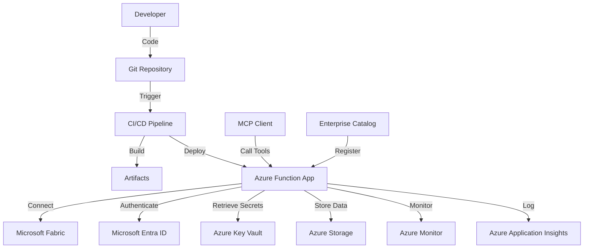

# Deployment Overview

## 🚀 Introduction

The MCP Platform Framework is designed for deployment as Azure Function Apps, providing a scalable, serverless architecture for hosting MCP tools. This deployment approach ensures high availability, automatic scaling, and seamless integration with the Microsoft Azure ecosystem.

### Key Benefits

- **Serverless Architecture**: No infrastructure management required
- **Automatic Scaling**: Scales based on demand without manual intervention
- **High Availability**: Built-in redundancy and failover capabilities
- **Cost Optimization**: Pay only for actual usage
- **Azure Integration**: Native integration with Azure services (Fabric, Key Vault, Entra ID)
- **CI/CD Ready**: Built-in support for automated deployment pipelines

---

## 🏗️ Deployment Architecture

### High-Level Architecture



### Component Interaction

1. **Development**: Developers create MCP tools using the framework
2. **Source Control**: Code is stored in Git repositories
3. **CI/CD Pipeline**: Automated pipelines build, test, and deploy the code
4. **Azure Function App**: Hosts the MCP tools as serverless functions
5. **Azure Services**: Function App integrates with various Azure services
6. **MCP Clients**: External clients call the deployed tools via HTTP endpoints

---

## 📋 Deployment Options

### Supported Deployment Targets

| Target | Description | Use Case | Recommended |
|--------|-------------|----------|--------------|
| **Azure Function App (Consumption Plan)** | Serverless, pay-per-use | Production workloads with variable demand | ✅ Yes |
| **Azure Function App (Premium Plan)** | Enhanced performance, VNET integration | High-performance, enterprise workloads | ✅ Yes |
| **Azure Function App (Dedicated Plan)** | Fixed capacity, predictable costs | Steady, predictable workloads | ⚠️ Conditional |
| **Azure Container Apps** | Container-based deployment | Custom runtime requirements | ❌ No |
| **Azure Kubernetes Service** | Full container orchestration | Complex microservices | ❌ No |

### Deployment Environments

The framework supports deployment to multiple environments:

| Environment | Purpose | Configuration | Access |
|-------------|---------|---------------|--------|
| **Development (DEV)** | Local development and testing | Local settings, mock services | Developer |
| **Test (TEST)** | Integration testing | Shared test services | Team |
| **Staging (STAG)** | Pre-production validation | Production-like services | Limited |
| **Production (PROD)** | Live production | Full production services | Controlled |

---

## 🎯 Deployment Requirements

### Prerequisites

#### Azure Requirements

- **Azure Subscription**: Active Azure subscription with appropriate permissions
- **Resource Group**: Dedicated resource group for MCP deployments
- **Service Principal**: Azure service principal with contributor permissions
- **Key Vault**: Azure Key Vault for secrets management
- **Storage Account**: Azure Storage Account for function app storage
- **Application Insights**: Azure Application Insights for monitoring
- **Microsoft Fabric**: Fabric workspace and capacities for data access

#### Tooling Requirements

- **Azure CLI**: Version 2.50.0 or higher
- **Azure Functions Core Tools**: Version 4.x
- **Python**: Version 3.9, 3.10, or 3.11
- **Git**: Version 2.30.0 or higher
- **Docker**: For container-based builds (optional)

#### Permissions

Required Azure RBAC roles:

| Role | Scope | Purpose |
|------|-------|---------|
| **Contributor** | Resource Group | Deploy and manage resources |
| **Key Vault Secrets User** | Key Vault | Retrieve secrets |
| **Application Insights Contributor** | Application Insights | Configure monitoring |
| **Storage Account Contributor** | Storage Account | Manage storage |
| **Fabric Contributor** | Fabric Workspace | Access Fabric resources |
| **Managed Identity Contributor** | Subscription | Create managed identities |

---

## 🚀 Quick Start Deployment

### Deploy Your First MCP Tool

#### 1. Prerequisites Check

```bash
# Check Azure CLI version
az --version

# Check Azure Functions Core Tools
func --version

# Check Python version
python --version

# Login to Azure
az login

# Set subscription
az account set --subscription "Your-Subscription-Name"
```

#### 2. Create Infrastructure

```bash
# Create resource group
az group create --name mcp-prod-rg --location eastus

# Create storage account
az storage account create \
    --name mcpstorageprod \
    --resource-group mcp-prod-rg \
    --location eastus \
    --sku Standard_LRS

# Create Key Vault
az keyvault create \
    --name mcp-kv-prod \
    --resource-group mcp-prod-rg \
    --location eastus \
    --enabled-for-deployment true \
    --enabled-for-disk-encryption true \
    --enabled-for-template-deployment true

# Create Application Insights
az monitor app-insights create \
    --name mcp-appinsights-prod \
    --resource-group mcp-prod-rg \
    --location eastus \
    --application-type web \
    --workspace "mcp-prod-rg"

# Create Function App
az functionapp create \
    --name mcp-func-prod \
    --resource-group mcp-prod-rg \
    --consumption-plan-location eastus \
    --runtime python \
    --runtime-version 3.11 \
    --functions-version 4 \
    --storage-account mcpstorageprod \
    --os-type Linux \
    --disable-application-insights false \
    --app-insights-name mcp-appinsights-prod
```

#### 3. Configure Framework

```bash
# Clone the MCP Platform Framework
git clone https://github.com/unhcr/mcp-platform-framework.git
cd mcp-platform-framework

# Create domain repository from template
git clone https://github.com/unhcr/mcp-template.git mcp-donor-management
cd mcp-donor-management

# Configure environment
cp config/example.env config/prod.env
# Edit config/prod.env with your settings

# Install dependencies
pip install -r requirements.txt
```

#### 4. Deploy Using CI/CD (Recommended)

```bash
# Create Azure DevOps pipeline or GitHub Actions workflow
# The framework includes pre-configured pipeline templates

# For Azure DevOps:
# 1. Create new pipeline
# 2. Select your repository
# 3. Choose the provided YAML template
# 4. Configure variables
# 5. Run pipeline

# For GitHub Actions:
# 1. Create .github/workflows/deploy.yml
# 2. Configure secrets in repository settings
# 3. Push to trigger workflow
```

#### 5. Manual Deployment (Development)

```bash
# Build and deploy using Azure Functions Core Tools
func azure functionapp publish mcp-func-prod \
    --python \
    --no-build \
    --overwrite-settings-from-local

# Or using Azure CLI
az functionapp deployment source config-zip \
    --resource-group mcp-prod-rg \
    --name mcp-func-prod \
    --src ./deploy.zip
```

---

## 📊 Deployment Configuration

### Configuration Files

The framework uses a hierarchical configuration system:

```
config/
├── default.yaml          # Default configuration
├── dev.yaml              # Development environment
├── test.yaml             # Test environment
├── stag.yaml             # Staging environment
├── prod.yaml             # Production environment
├── local.env             # Local development (gitignored)
└── secrets/              # Secret files (gitignored)
    ├── dev.env
    ├── test.env
    ├── stag.env
    └── prod.env
```

### Environment-Specific Configuration

#### Development (config/dev.yaml)

```yaml
environment: "dev"
debug: true
logging:
  level: "DEBUG"
  console: true
  
azure:
  function_app:
    name: "mcp-func-dev"
    resource_group: "mcp-dev-rg"
    
  key_vault:
    name: "mcp-kv-dev"
    
  storage:
    account: "mcpstoragedev"
    
  application_insights:
    name: "mcp-appinsights-dev"

fabric:
  workspace: "DEV"
  endpoint: "https://api.fabric.microsoft.com"

features:
  auto_registration: true
  telemetry: true
  audit_logging: true
```

#### Production (config/prod.yaml)

```yaml
environment: "prod"
debug: false
logging:
  level: "INFO"
  console: false
  
azure:
  function_app:
    name: "mcp-func-prod"
    resource_group: "mcp-prod-rg"
    
  key_vault:
    name: "mcp-kv-prod"
    
  storage:
    account: "mcpstorageprod"
    
  application_insights:
    name: "mcp-appinsights-prod"

fabric:
  workspace: "PROD"
  endpoint: "https://api.fabric.microsoft.com"

features:
  auto_registration: true
  telemetry: true
  audit_logging: true
  
security:
  require_https: true
  cors:
    allowed_origins:
      - "https://my-org.org"
      - "https://portal.my-org.org"
    allowed_methods:
      - "GET"
      - "POST"
      - "OPTIONS"
```

---

## 🔧 Deployment Parameters

### Function App Configuration

| Parameter | Description | Default | Required |
|-----------|-------------|---------|----------|
| `FUNCTIONS_WORKER_RUNTIME` | Runtime language | `python` | ✅ |
| `FUNCTIONS_EXTENSION_VERSION` | Functions version | `~4` | ✅ |
| `PYTHON_VERSION` | Python version | `3.11` | ✅ |
| `APPINSIGHTS_INSTRUMENTATIONKEY` | App Insights key | - | ✅ |
| `AzureWebJobsStorage` | Storage connection string | - | ✅ |
| `WEBSITE_RUN_FROM_PACKAGE` | Deployment method | `1` | ❌ |
| `WEBSITE_CONTENTAZUREFILECONNECTIONSTRING` | Storage connection | - | ✅ |
| `WEBSITE_CONTENTSHARE` | File share name | - | ✅ |

### MCP Framework Configuration

| Parameter | Description | Default | Required |
|-----------|-------------|---------|----------|
| `MCP_ENVIRONMENT` | Deployment environment | `dev` | ✅ |
| `MCP_DOMAIN` | Domain name | - | ✅ |
| `MCP_VERSION` | Framework version | `1.0.0` | ❌ |
| `MCP_CATALOG_ENDPOINT` | Catalog API endpoint | - | ✅ |
| `MCP_TELEMETRY_ENABLED` | Enable telemetry | `true` | ❌ |
| `MCP_AUDIT_ENABLED` | Enable audit logging | `true` | ❌ |

---

## 📈 Scaling and Performance

### Scaling Options

#### Consumption Plan (Recommended)

- **Automatic Scaling**: Scales based on number of requests
- **Cold Start**: May experience cold starts for infrequent requests
- **Cost**: Pay per execution and resource consumption
- **Max Instances**: 200 concurrent instances
- **Timeout**: 10 minutes per execution

#### Premium Plan

- **Pre-warmed Instances**: Reduced cold start latency
- **VNET Integration**: Can integrate with virtual networks
- **Enhanced Performance**: Better performance for high-load scenarios
- **Cost**: Fixed cost plus execution costs
- **Max Instances**: 200 concurrent instances
- **Timeout**: 60 minutes per execution

#### Dedicated Plan

- **Fixed Capacity**: Predictable performance
- **No Cold Starts**: Always warm instances
- **Cost**: Fixed cost regardless of usage
- **Max Instances**: Configurable
- **Timeout**: 60 minutes per execution

### Performance Optimization

#### Cold Start Mitigation

```python
# Use warm-up triggers
import azure.functions as func

app = func.FunctionApp(http_auth_level=func.AuthLevel.ANONYMOUS)

@app.route(route="warmup")
@app.function_name("warmup")
def warmup(req: func.HttpRequest) -> func.HttpResponse:
    """Warm-up endpoint to prevent cold starts"""
    # Initialize all modules
    from platform.framework import initialize_framework
    initialize_framework()
    
    return func.HttpResponse("Warm-up complete", status_code=200)

# Configure warm-up timer trigger
@app.timer_trigger(
    arg_name="mytimer",
    schedule="0 */5 * * * *",  # Every 5 minutes
    run_on_startup=True
)
def warmup_timer(mytimer: func.TimerRequest) -> None:
    """Timer-triggered warm-up"""
    import requests
    requests.get("https://your-function-app.azurewebsites.net/api/warmup")
```

#### Memory Optimization

```python
# Reduce memory usage
import gc
import sys

def optimize_memory():
    """Clean up memory usage"""
    # Remove unused modules
    modules_to_remove = [mod for mod in sys.modules if mod.startswith('platform.')]
    for mod in modules_to_remove:
        if mod in sys.modules:
            del sys.modules[mod]
    
    # Run garbage collection
    gc.collect()

# Call periodically in long-running functions
optimize_memory()
```

---

## 🔒 Security Configuration

### Network Security

#### Private Endpoints

```bash
# Create private endpoint for Function App
az network private-endpoint create \
    --name mcp-func-pe \
    --resource-group mcp-prod-rg \
    --vnet-name mcp-vnet \
    --subnet mcp-subnet \
    --private-connection-resource-id "/subscriptions/.../Microsoft.Web/sites/mcp-func-prod" \
    --group-id sites \
    --connection-name mcp-func-pe-conn

# Create private DNS zone
az network private-dns zone create \
    --name privatelink.azurewebsites.net \
    --resource-group mcp-prod-rg

# Link DNS zone to VNET
az network private-dns link vnet create \
    --name mcp-dns-link \
    --resource-group mcp-prod-rg \
    --zone-name privatelink.azurewebsites.net \
    --vnet mcp-vnet \
    --registration-enabled false

# Create DNS record
az network private-dns record a create \
    --name mcp-func-prod \
    --zone-name privatelink.azurewebsites.net \
    --resource-group mcp-prod-rg \
    --ip-addresses <private-ip>
```

#### Network Security Groups

```bash
# Create NSG for Function App
az network nsg create \
    --name mcp-func-nsg \
    --resource-group mcp-prod-rg \
    --location eastus

# Add inbound rules
az network nsg rule create \
    --name Allow-HTTPS \
    --nsg-name mcp-func-nsg \
    --resource-group mcp-prod-rg \
    --priority 100 \
    --protocol Tcp \
    --direction Inbound \
    --destination-port-ranges 443 \
    --access Allow

# Associate NSG with subnet
az network vnet subnet update \
    --name mcp-subnet \
    --vnet-name mcp-vnet \
    --resource-group mcp-prod-rg \
    --network-security-group mcp-func-nsg
```

### Identity and Access

#### Managed Identity

```bash
# Enable system-assigned managed identity
az functionapp identity assign \
    --name mcp-func-prod \
    --resource-group mcp-prod-rg \
    --identity-type SystemAssigned

# Get identity principal ID
principal_id=$(az functionapp identity show \
    --name mcp-func-prod \
    --resource-group mcp-prod-rg \
    --query principalId \
    --output tsv)

# Assign permissions to Key Vault
az keyvault set-policy \
    --name mcp-kv-prod \
    --resource-group mcp-prod-rg \
    --object-id $principal_id \
    --secret-permissions get list \
    --key-permissions get list \
    --certificate-permissions get list

# Assign permissions to Fabric
az role assignment create \
    --assignee $principal_id \
    --role "Fabric Contributor" \
    --scope /subscriptions/.../resourceGroups/mcp-prod-rg
```

#### User-Assigned Managed Identity

```bash
# Create user-assigned identity
az identity create \
    --name mcp-identity-prod \
    --resource-group mcp-prod-rg

# Assign to Function App
az functionapp identity assign \
    --name mcp-func-prod \
    --resource-group mcp-prod-rg \
    --identities /subscriptions/.../userAssignedIdentities/mcp-identity-prod

# Assign permissions
identity_principal_id=$(az identity show \
    --name mcp-identity-prod \
    --resource-group mcp-prod-rg \
    --query principalId \
    --output tsv)

az role assignment create \
    --assignee $identity_principal_id \
    --role "Key Vault Secrets User" \
    --scope /subscriptions/.../resourceGroups/mcp-prod-rg
```

---

## 📊 Monitoring and Observability

### Built-in Monitoring

The framework integrates with Azure Monitor and Application Insights:

```python
# Telemetry is automatically collected
from platform.telemetry import telemetry

# Custom metrics
telemetry.track_metric("custom.metric", 42)

# Custom events
telemetry.track_event("CustomEvent", {"key": "value"})

# Custom traces
telemetry.track_trace("Debug message", "INFO")
```

### Alerts Configuration

```bash
# Create alert for failed requests
az monitor metrics alert create \
    --name "MCP-Failed-Requests" \
    --resource-group mcp-prod-rg \
    --scopes /subscriptions/.../Microsoft.Web/sites/mcp-func-prod \
    --condition "Requests where ResponseCode == 5xx" \
    --threshold 5 \
    --window-size 5m \
    --evaluation-frequency 1m \
    --action-group /subscriptions/.../actionGroups/EmailAdmins \
    --description "High number of failed requests"

# Create alert for high latency
az monitor metrics alert create \
    --name "MCP-High-Latency" \
    --resource-group mcp-prod-rg \
    --scopes /subscriptions/.../Microsoft.Web/sites/mcp-func-prod \
    --condition "Average RequestDuration > 5000" \
    --threshold 1 \
    --window-size 5m \
    --evaluation-frequency 1m \
    --action-group /subscriptions/.../actionGroups/EmailAdmins \
    --description "High request latency"
```

### Log Analytics Queries

```kusto
// Get all MCP tool invocations
requests
| where cloud_RoleName == "mcp-func-prod"
| where url contains "/api/tools/"
| project timestamp, operation_Name, resultCode, duration, url
| order by timestamp desc

// Get error rates by tool
requests
| where cloud_RoleName == "mcp-func-prod"
| where resultCode >= 400
| summarize count() by operation_Name, resultCode
| order by count_ desc

// Get performance metrics
traces
| where cloud_RoleName == "mcp-func-prod"
| where message contains "MCP-TELEMETRY"
| extend telemetry = parse_json(message)
| project timestamp, tool=telemetry.tool, duration_ms=telemetry.duration_ms, status=telemetry.status
| summarize avg(duration_ms), count() by tool, status
| order by avg_duration_ms desc
```

---

## 🔄 CI/CD Pipeline

### Pipeline Overview

The framework includes pre-configured CI/CD pipelines for:

- **Azure DevOps**: YAML pipelines with multi-stage deployment
- **GitHub Actions**: Workflow files for automated deployment
- **GitLab CI/CD**: Pipeline configuration for GitLab

### Azure DevOps Pipeline

```yaml
# azure-pipelines.yml
trigger:
  branches:
    include:
      - main
      - releases/*
  paths:
    exclude:
      - docs/*
      - README.md

variables:
  azureSubscription: 'Azure-Service-Connection'
  functionAppName: 'mcp-func-prod'
  resourceGroup: 'mcp-prod-rg'
  pythonVersion: '3.11'

stages:
  - stage: Build
    displayName: Build and Test
    jobs:
      - job: Build
        displayName: Build
        pool:
          vmImage: 'ubuntu-latest'
        steps:
          - task: UsePythonVersion@0
            inputs:
              versionSpec: '$(pythonVersion)'
              addToPath: true
          
          - script: |
              python -m pip install --upgrade pip
              pip install -r requirements.txt
              pip install -r requirements-dev.txt
            displayName: 'Install dependencies'
          
          - script: |
              python -m pytest tests/ --cov=platform --cov-report=xml
            displayName: 'Run tests'
          
          - script: |
              python -m bandit -r platform/ -f json -o bandit-results.json
            displayName: 'Security scanning'
          
          - task: PublishTestResults@2
            inputs:
              testResultsFormat: 'JUnit'
              testResultsFiles: '**/test-results.xml'
          
          - task: PublishCodeCoverageResults@1
            inputs:
              codeCoverageTool: 'Cobertura'
              summaryFileLocation: '$(System.DefaultWorkingDirectory)/**/coverage.xml'
          
          - task: PublishPipelineArtifact@1
            inputs:
              targetPath: '$(System.DefaultWorkingDirectory)'
              artifact: 'drop'
              publishLocation: 'pipeline'

  - stage: Deploy
    displayName: Deploy
    dependsOn: Build
    condition: succeeded()
    jobs:
      - deployment: Deploy
        displayName: Deploy
        environment: 'Production'
        pool:
          vmImage: 'ubuntu-latest'
        strategy:
          runOnce:
            deploy:
              steps:
                - task: UsePythonVersion@0
                  inputs:
                    versionSpec: '$(pythonVersion)'
                    addToPath: true
                
                - task: DownloadPipelineArtifact@2
                  inputs:
                    buildType: 'current'
                    artifactName: 'drop'
                    targetPath: '$(System.DefaultWorkingDirectory)'
                
                - script: |
                    pip install -r requirements.txt
                  displayName: 'Install production dependencies'
                
                - task: AzureFunctionApp@1
                  inputs:
                    azureSubscription: '$(azureSubscription)'
                    appType: 'functionAppLinux'
                    appName: '$(functionAppName)'
                    package: '$(System.DefaultWorkingDirectory)'
                    runtime: 'python'
                    runtimeVersion: '$(pythonVersion)'
                    startUpCommand: 'gunicorn --bind :$PORT --workers 1 --threads 8 --timeout 0 main:app'
```

### GitHub Actions Workflow

```yaml
# .github/workflows/deploy.yml
name: Deploy MCP Framework

on:
  push:
    branches: [ main, releases/** ]
    paths-ignore:
      - 'docs/**'
      - 'README.md'
  pull_request:
    branches: [ main ]

env:
  AZURE_FUNCTIONAPP_NAME: 'mcp-func-prod'
  AZURE_RESOURCE_GROUP: 'mcp-prod-rg'
  PYTHON_VERSION: '3.11'

jobs:
  build:
    runs-on: ubuntu-latest
    steps:
      - uses: actions/checkout@v3
      
      - name: Set up Python
        uses: actions/setup-python@v4
        with:
          python-version: ${{ env.PYTHON_VERSION }}
      
      - name: Install dependencies
        run: |
          python -m pip install --upgrade pip
          pip install -r requirements.txt
          pip install -r requirements-dev.txt
      
      - name: Run tests
        run: |
          python -m pytest tests/ --cov=platform --cov-report=xml
      
      - name: Security scanning
        run: |
          python -m bandit -r platform/ -f json -o bandit-results.json
      
      - name: Upload artifacts
        uses: actions/upload-artifact@v3
        with:
          name: python-app
          path: .

  deploy:
    needs: build
    runs-on: ubuntu-latest
    environment: production
    steps:
      - uses: actions/checkout@v3
      
      - name: Download artifacts
        uses: actions/download-artifact@v3
        with:
          name: python-app
          path: .
      
      - name: Set up Python
        uses: actions/setup-python@v4
        with:
          python-version: ${{ env.PYTHON_VERSION }}
      
      - name: Install production dependencies
        run: |
          pip install -r requirements.txt
      
      - name: 'Login via Azure CLI'
        uses: azure/login@v1
        with:
          creds: ${{ secrets.AZURE_CREDENTIALS }}
      
      - name: Deploy to Azure Function App
        uses: Azure/functions-action@v1
        with:
          app-name: ${{ env.AZURE_FUNCTIONAPP_NAME }}
          resource-group: ${{ env.AZURE_RESOURCE_GROUP }}
          package: .
          runtime: python
          runtime-version: ${{ env.PYTHON_VERSION }}
```

---

## 📝 Deployment Checklist

### Pre-Deployment Checklist

- [ ] **Code Quality**
  - [ ] All tests pass
  - [ ] Security scanning completed
  - [ ] Code review approved
  - [ ] Documentation updated
  
- [ ] **Configuration**
  - [ ] Environment-specific configuration files created
  - [ ] Secrets stored in Key Vault
  - [ ] App settings configured
  - [ ] Network configuration verified
  
- [ ] **Infrastructure**
  - [ ] Resource group created
  - [ ] Storage account created
  - [ ] Key Vault created and configured
  - [ ] Application Insights created
  - [ ] Function App created
  - [ ] Managed identity configured
  
- [ ] **Permissions**
  - [ ] Service principal has required permissions
  - [ ] Managed identity has required permissions
  - [ ] Access policies configured
  
- [ ] **Security**
  - [ ] Network security groups configured
  - [ ] Private endpoints configured (if required)
  - [ ] SSL/TLS configured
  - [ ] CORS policies configured

### Post-Deployment Checklist

- [ ] **Verification**
  - [ ] Function App deployed successfully
  - [ ] Health check endpoint responds
  - [ ] Sample tool invocations work
  - [ ] Telemetry is being collected
  
- [ ] **Monitoring**
  - [ ] Alerts configured
  - [ ] Logs are accessible
  - [ ] Metrics are being collected
  - [ ] Dashboards created
  
- [ ] **Documentation**
  - [ ] Deployment documentation updated
  - [ ] Runbook created
  - [ ] Troubleshooting guide updated
  
- [ ] **Communication**
  - [ ] Stakeholders notified
  - [ ] Change log updated
  - [ ] Support team briefed

---

## 🔍 Troubleshooting

### Common Deployment Issues

#### Deployment Fails with Permission Error

**Symptom:** `ERROR: Insufficient permissions to deploy to resource group`

**Solution:**
```bash
# Check current permissions
az role assignment list --assignee <your-email> --scope /subscriptions/.../resourceGroups/mcp-prod-rg

# Assign Contributor role
az role assignment create \
    --assignee <your-email> \
    --role Contributor \
    --scope /subscriptions/.../resourceGroups/mcp-prod-rg
```

#### Function App Not Starting

**Symptom:** Function App shows "Starting" status indefinitely

**Solution:**
```bash
# Check deployment logs
az webapp deployment log tail \
    --name mcp-func-prod \
    --resource-group mcp-prod-rg

# Check application logs
az webapp log tail \
    --name mcp-func-prod \
    --resource-group mcp-prod-rg

# Check for missing dependencies
az functionapp config appsettings list \
    --name mcp-func-prod \
    --resource-group mcp-prod-rg
```

#### Module Import Errors

**Symptom:** `ModuleNotFoundError: No module named 'platform'`

**Solution:**
```bash
# Ensure requirements.txt includes all dependencies
echo "platform-framework" >> requirements.txt

# Reinstall dependencies
pip install -r requirements.txt --target ./packages

# Configure PYTHONPATH
az functionapp config appsettings set \
    --name mcp-func-prod \
    --resource-group mcp-prod-rg \
    --settings PYTHONPATH="/home/site/wwwroot/packages"
```

#### Cold Start Issues

**Symptom:** First request after deployment is very slow

**Solution:**
```python
# Implement warm-up trigger
import azure.functions as func

@app.timer_trigger(
    arg_name="mytimer",
    schedule="0 */5 * * * *",
    run_on_startup=True
)
def warmup(mytimer: func.TimerRequest) -> None:
    # Initialize framework
    from platform.framework import initialize_framework
    initialize_framework()
```

#### Connection String Issues

**Symptom:** `ValueError: Unable to find connection string`

**Solution:**
```bash
# Verify connection strings are configured
az functionapp config connection-string list \
    --name mcp-func-prod \
    --resource-group mcp-prod-rg

# Set missing connection strings
az functionapp config connection-string set \
    --name mcp-func-prod \
    --resource-group mcp-prod-rg \
    --settings AzureWebJobsStorage="DefaultEndpointsProtocol=https;..."
```

---

## 📚 Additional Resources

- [Azure Functions Documentation](https://learn.microsoft.com/en-us/azure/azure-functions/)
- [Azure Functions Python Developer Guide](https://learn.microsoft.com/en-us/azure/azure-functions/functions-reference-python)
- [Azure DevOps Pipelines](https://learn.microsoft.com/en-us/azure/devops/pipelines/)
- [GitHub Actions for Azure](https://learn.microsoft.com/en-us/azure/developer/github/)
- [Azure Monitor Documentation](https://learn.microsoft.com/en-us/azure/azure-monitor/)
- [Azure Security Best Practices](https://learn.microsoft.com/en-us/azure/security/fundamentals/)

---

## 🔄 Changelog

| Version | Date | Changes |
|---------|------|---------|
| 1.0.0 | 2026-05-01 | Initial deployment documentation |
| 1.1.0 | 2026-05-15 | Added CI/CD pipeline templates |
| 1.2.0 | 2026-06-01 | Added security configuration section |
| 1.3.0 | 2026-06-15 | Added troubleshooting guide |
