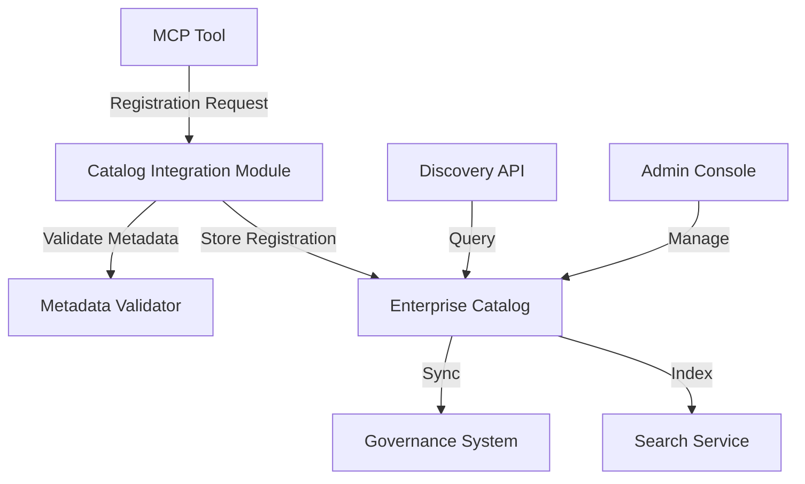

# Catalog Integration Module

## 📚 Overview

The Catalog Integration Module provides automatic registration of MCP services with the enterprise registry and governance catalog. This ensures that all deployed MCP tools are discoverable, properly classified, and compliant with organizational governance policies.

### Purpose
- **Service Discovery**: Enable automatic discovery of MCP services across the enterprise
- **Governance Compliance**: Enforce classification, ownership, and SLA requirements
- **Metadata Management**: Maintain standardized metadata for all registered tools
- **Access Control**: Provide catalog-level access control and visibility

### Key Features
- ✅ Automatic service registration on deployment
- ✅ Metadata validation and standardization
- ✅ Integration with enterprise governance catalog
- ✅ Classification enforcement
- ✅ Ownership and SLA tracking
- ✅ Search and discovery capabilities

---

## 🏗️ Architecture

### Component Diagram



### Data Flow

1. **Tool Registration**: When an MCP tool is deployed, the framework automatically sends registration data to the catalog
2. **Metadata Validation**: The module validates all required metadata fields and classifications
3. **Catalog Storage**: Valid registrations are stored in the enterprise catalog database
4. **Governance Sync**: Registration data is synchronized with the governance system
5. **Discovery**: Tools become discoverable through the catalog API and admin console

### Integration Points

- **Azure Purview**: For data governance and classification
- **Microsoft Entra ID**: For access control and authentication
- **Azure Resource Graph**: For resource discovery and inventory
- **Custom Enterprise Catalog**: For MCP-specific metadata

---

## 🚀 Quick Start

### Basic Registration

The Catalog Integration Module works automatically when you use the framework's tool decorators. Simply declare your tool with the appropriate metadata:

```python
from platform.framework import tool
from platform.catalog import Classification, SLATier

@tool(
    name="GetDonorPortfolioHealth",
    description="Retrieves health metrics for donor portfolios",
    classification=Classification.CONFIDENTIAL,
    sla_tier=SLATier.GOLD,
    owner="DER",
    domain="DonorManagement"
)
def get_donor_portfolio_health(donor_id: str) -> dict:
    # Your implementation here
    pass
```

### Manual Registration (Advanced)

For custom registration scenarios:

```python
from platform.catalog import CatalogClient, ToolMetadata

# Create catalog client
catalog = CatalogClient()

# Define tool metadata
metadata = ToolMetadata(
    name="CustomTool",
    description="Custom tool description",
    classification="CONFIDENTIAL",
    domain="CustomDomain",
    owner="TeamName",
    sla_tier="Gold",
    version="1.0.0",
    parameters=[
        {"name": "param1", "type": "string", "required": True},
        {"name": "param2", "type": "int", "required": False}
    ]
)

# Register tool
registration = catalog.register_tool(metadata)
print(f"Tool registered with ID: {registration.tool_id}")
```

---

## ⚙️ Configuration

### Environment Variables

| Variable | Description | Required | Default |
|----------|-------------|----------|---------|
| `CATALOG_ENDPOINT` | Enterprise catalog API endpoint | ✅ | - |
| `CATALOG_API_KEY` | API key for catalog authentication | ✅ | - |
| `CATALOG_TIMEOUT` | Request timeout in seconds | ❌ | 30 |
| `CATALOG_RETRY_COUNT` | Number of retry attempts | ❌ | 3 |
| `CATALOG_BATCH_SIZE` | Batch size for bulk operations | ❌ | 100 |

### Configuration File (`config/catalog.yaml`)

```yaml
catalog:
  endpoint: "https://catalog.my-org.org/api/v1"
  api_key: "${CATALOG_API_KEY}"
  timeout: 30
  retry:
    count: 3
    backoff: 2
  batch:
    size: 100
    enabled: true
  
  # Classification mappings
  classifications:
    PUBLIC: "Public"
    INTERNAL: "Internal"
    CONFIDENTIAL: "Confidential"
    STRICTLY_CONFIDENTIAL: "Strictly Confidential"
  
  # SLA tier mappings
  sla_tiers:
    BRONZE: "Bronze"
    SILVER: "Silver"
    GOLD: "Gold"
    PLATINUM: "Platinum"
  
  # Required metadata fields
  required_fields:
    - name
    - description
    - classification
    - domain
    - owner
    - version
```

### Azure Integration Configuration

```yaml
azure:
  purview:
    enabled: true
    endpoint: "https://your-purview-account.purview.azure.com"
    tenant_id: "${AZURE_TENANT_ID}"
    
  resource_graph:
    enabled: true
    scope: "/subscriptions/${AZURE_SUBSCRIPTION_ID}"
```

---

## 🔧 API Reference

### CatalogClient Class

#### `register_tool(metadata: ToolMetadata) -> ToolRegistration`

Register a new tool in the enterprise catalog.

**Parameters:**
- `metadata` (ToolMetadata): Complete tool metadata

**Returns:**
- `ToolRegistration`: Registration confirmation with tool_id

**Raises:**
- `CatalogRegistrationError`: If registration fails
- `ValidationError`: If metadata is invalid

**Example:**
```python
from platform.catalog import CatalogClient, ToolMetadata

catalog = CatalogClient()
metadata = ToolMetadata(
    name="MyTool",
    description="Tool description",
    classification="CONFIDENTIAL",
    domain="MyDomain",
    owner="MyTeam"
)

registration = catalog.register_tool(metadata)
```

#### `update_tool(tool_id: str, updates: dict) -> ToolRegistration`

Update an existing tool registration.

**Parameters:**
- `tool_id` (str): Unique tool identifier
- `updates` (dict): Dictionary of fields to update

**Returns:**
- `ToolRegistration`: Updated registration

**Example:**
```python
catalog.update_tool(
    tool_id="tool-123",
    updates={"description": "Updated description", "version": "2.0.0"}
)
```

#### `deregister_tool(tool_id: str) -> bool`

Remove a tool from the catalog.

**Parameters:**
- `tool_id` (str): Unique tool identifier

**Returns:**
- `bool`: True if successful

#### `get_tool(tool_id: str) -> ToolMetadata`

Retrieve tool metadata by ID.

#### `search_tools(query: str, filters: dict = None) -> List[ToolMetadata]`

Search for tools in the catalog.

**Parameters:**
- `query` (str): Search query string
- `filters` (dict): Filter criteria (classification, domain, owner, etc.)

**Example:**
```python
# Search for all CONFIDENTIAL tools in DonorManagement domain
results = catalog.search_tools(
    query="",
    filters={
        "classification": "CONFIDENTIAL",
        "domain": "DonorManagement"
    }
)
```

#### `list_tools(domain: str = None, owner: str = None) -> List[ToolMetadata]`

List all tools, optionally filtered by domain or owner.

#### `validate_metadata(metadata: ToolMetadata) -> ValidationResult`

Validate tool metadata before registration.

### ToolMetadata Class

Complete metadata structure for MCP tools:

```python
@dataclass
class ToolMetadata:
    name: str
    description: str
    classification: Classification
    domain: str
    owner: str
    version: str = "1.0.0"
    sla_tier: SLATier = SLATier.SILVER
    parameters: List[ParameterMetadata] = field(default_factory=list)
    tags: List[str] = field(default_factory=list)
    dependencies: List[str] = field(default_factory=list)
    documentation_url: str = None
    support_contact: str = None
    
    # Azure-specific
    resource_group: str = None
    subscription_id: str = None
    function_app: str = None
```

### Classification Enum

```python
class Classification(Enum):
    PUBLIC = "PUBLIC"
    INTERNAL = "INTERNAL"
    CONFIDENTIAL = "CONFIDENTIAL"
    STRICTLY_CONFIDENTIAL = "STRICTLY_CONFIDENTIAL"
```

### SLATier Enum

```python
class SLATier(Enum):
    BRONZE = "Bronze"
    SILVER = "Silver"
    GOLD = "Gold"
    PLATINUM = "Platinum"
```

---

## 🎯 Best Practices

### ⭐ Metadata Quality

**Always provide complete and accurate metadata:**

```python
# ✅ GOOD - Complete metadata
@tool(
    name="GetDonorPortfolioHealth",
    description="Retrieves comprehensive health metrics for donor portfolios including risk scores, performance trends, and compliance status",
    classification=Classification.CONFIDENTIAL,
    sla_tier=SLATier.GOLD,
    owner="DER",
    domain="DonorManagement",
    version="1.2.0",
    tags=["donor", "portfolio", "analytics", "health"],
    parameters=[
        ParameterMetadata(name="donor_id", type="string", required=True, description="Unique donor identifier"),
        ParameterMetadata(name="time_range", type="string", required=False, description="Time range for analysis (default: 30d)")
    ]
)

# ❌ BAD - Incomplete metadata
@tool(
    name="GetDonorStuff",
    description="Gets donor info"
)
```

### ⭐ Classification Accuracy

**Match classification to actual data sensitivity:**

| Data Type | Recommended Classification |
|-----------|---------------------------|
| Public information | PUBLIC |
| Internal operational data | INTERNAL |
| Donor personal information | CONFIDENTIAL |
| Financial data, PII | STRICTLY_CONFIDENTIAL |

### ⭐ SLA Tier Selection

**Choose appropriate SLA based on business criticality:**

| Criticality | SLA Tier | Response Time | Availability |
|-------------|----------|---------------|--------------|
| Low impact | BRONZE | < 24h | 99% |
| Standard | SILVER | < 4h | 99.5% |
| Business critical | GOLD | < 1h | 99.9% |
| Mission critical | PLATINUM | < 15min | 99.95% |

### ⭐ Tagging Strategy

**Use consistent and meaningful tags:**

```python
# ✅ GOOD - Consistent tagging
tags=["donor", "analytics", "finance", "reporting"]

# ❌ BAD - Inconsistent or vague
tags=["stuff", "things", "data"]
```

### ⭐ Version Management

**Follow semantic versioning:**
- **MAJOR**: Breaking changes
- **MINOR**: Backward-compatible new features
- **PATCH**: Backward-compatible bug fixes

```python
# Version history
# 1.0.0 - Initial release
# 1.1.0 - Added new parameters
# 1.1.1 - Bug fixes
# 2.0.0 - Breaking changes to response format
```

---

## 🔍 Troubleshooting

### Common Issues

#### Registration Fails with Validation Error

**Symptom:** `ValidationError: Missing required field 'classification'`

**Solution:** Ensure all required metadata fields are provided:

```python
# Check required fields
required_fields = ['name', 'description', 'classification', 'domain', 'owner']
for field in required_fields:
    if not getattr(metadata, field):
        raise ValidationError(f"Missing required field: {field}")
```

#### Tool Not Appearing in Catalog

**Symptom:** Tool registered but not visible in catalog search

**Solution:** Check synchronization status:

```python
# Force sync
catalog.force_sync()

# Check sync status
sync_status = catalog.get_sync_status()
if sync_status.last_sync < datetime.now() - timedelta(hours=1):
    catalog.force_sync()
```

#### Classification Mismatch

**Symptom:** `ClassificationError: Classification 'SECRET' not recognized`

**Solution:** Use standard classification values:

```python
# Use enum values
from platform.catalog import Classification

# ✅ Correct
classification=Classification.CONFIDENTIAL

# ❌ Incorrect
classification="SECRET"  # Not a standard value
```

#### Duplicate Tool Registration

**Symptom:** `DuplicateRegistrationError: Tool 'GetDonorData' already registered`

**Solution:** Update existing registration instead:

```python
try:
    catalog.register_tool(metadata)
except DuplicateRegistrationError:
    # Update existing
    existing = catalog.get_tool_by_name(metadata.name)
    catalog.update_tool(existing.tool_id, metadata.to_dict())
```

---

## 📊 Monitoring and Metrics

### Catalog Health Metrics

The module exposes the following metrics:

| Metric | Description | Target |
|--------|-------------|--------|
| `catalog.registration.success` | Successful registrations | > 99% |
| `catalog.registration.failure` | Failed registrations | < 1% |
| `catalog.sync.latency` | Sync operation latency | < 5s |
| `catalog.search.latency` | Search query latency | < 1s |
| `catalog.tools.total` | Total registered tools | - |
| `catalog.tools.by_classification` | Tools by classification | - |

### Azure Monitor Integration

```python
from platform.telemetry import metrics

# Track registration metrics
metrics.increment("catalog.registration.success")
metrics.increment("catalog.registration.failure", tags=["reason:validation"])

# Track sync metrics
with metrics.timer("catalog.sync.latency"):
    catalog.force_sync()
```

---

## 🔒 Security Considerations

### Access Control

**Catalog API access is restricted:**

- Only authorized service principals can register tools
- Read access is available to all authenticated users
- Write access requires `catalog.write` permission

### Data Protection

**Sensitive metadata is encrypted:**

- API keys and connection strings are encrypted at rest
- Access to sensitive fields requires additional permissions
- Audit logs track all metadata access

### Audit Trail

All catalog operations are logged:

```json
{
  "timestamp": "2026-05-01T10:00:00Z",
  "operation": "register_tool",
  "user": "service-principal@my-org.org",
  "tool_id": "tool-123",
  "tool_name": "GetDonorPortfolioHealth",
  "status": "success",
  "classification": "CONFIDENTIAL"
}
```

---

## 🔄 Integration with Other Modules

### Authentication Module

Catalog integration uses the same authentication framework:

```python
from platform.auth import authenticated_tool

@authenticated_tool
@tool(name="SecureTool", classification=Classification.CONFIDENTIAL)
def secure_tool():
    pass  # Automatically registered with caller identity
```

### Authorization Module

Catalog access respects authorization policies:

```python
from platform.auth import requires_permission

@requires_permission("catalog.read")
def list_tools():
    return catalog.list_tools()

@requires_permission("catalog.write")
def register_tool(metadata):
    return catalog.register_tool(metadata)
```

### Telemetry Module

All catalog operations generate telemetry:

```json
{
  "tool": "CatalogIntegration",
  "operation": "register_tool",
  "domain": "Catalog",
  "duration_ms": 150,
  "status": "Success",
  "metadata": {
    "tool_name": "GetDonorPortfolioHealth",
    "classification": "CONFIDENTIAL"
  }
}
```

---

## 📝 Examples

### Complete Tool Registration Example

```python
from platform.framework import tool
from platform.catalog import Classification, SLATier, ParameterMetadata
from platform.auth import authenticated_tool, requires_permission
from platform.telemetry import instrumented

@authenticated_tool
@requires_permission("donor.read")
@instrumented
@tool(
    name="GetDonorPortfolioHealth",
    description="Retrieves comprehensive health metrics for donor portfolios",
    classification=Classification.CONFIDENTIAL,
    sla_tier=SLATier.GOLD,
    owner="DER",
    domain="DonorManagement",
    version="1.2.0",
    tags=["donor", "portfolio", "analytics", "health"],
    parameters=[
        ParameterMetadata(
            name="donor_id",
            type="string",
            required=True,
            description="Unique donor identifier (UUID format)",
            example="123e4567-e89b-12d3-a456-426614174000"
        ),
        ParameterMetadata(
            name="time_range",
            type="string",
            required=False,
            description="Time range for analysis",
            default="30d",
            enum=["7d", "30d", "90d", "1y"]
        )
    ],
    documentation_url="https://docs.my-org.org/mcp/donor-management#portfolio-health",
    support_contact="der-support@my-org.org"
)
def get_donor_portfolio_health(donor_id: str, time_range: str = "30d") -> dict:
    """
    Retrieves health metrics for a donor portfolio.
    
    Args:
        donor_id: Unique donor identifier
        time_range: Time range for analysis
        
    Returns:
        Dictionary containing health metrics, risk scores, and trends
        
    Raises:
        DonorNotFoundError: If donor does not exist
        AccessDeniedError: If user lacks required permissions
    """
    # Implementation here
    pass
```

### Bulk Registration Example

```python
from platform.catalog import CatalogClient, ToolMetadata, Classification, SLATier

def register_domain_tools():
    catalog = CatalogClient()
    
    tools = [
        ToolMetadata(
            name="GetDonorProfile",
            description="Retrieves donor profile information",
            classification=Classification.CONFIDENTIAL,
            domain="DonorManagement",
            owner="DER",
            sla_tier=SLATier.GOLD
        ),
        ToolMetadata(
            name="GetDonorContributions",
            description="Retrieves donor contribution history",
            classification=Classification.CONFIDENTIAL,
            domain="DonorManagement",
            owner="DER",
            sla_tier=SLATier.GOLD
        ),
        ToolMetadata(
            name="GetDonorRiskScore",
            description="Calculates donor risk score",
            classification=Classification.CONFIDENTIAL,
            domain="DonorManagement",
            owner="DER",
            sla_tier=SLATier.SILVER
        )
    ]
    
    # Bulk register
    results = catalog.register_tools_batch(tools)
    
    for result in results:
        if result.success:
            print(f"✅ Registered: {result.tool_name} (ID: {result.tool_id})")
        else:
            print(f"❌ Failed: {result.tool_name} - {result.error}")
```

### Search and Discovery Example

```python
from platform.catalog import CatalogClient, Classification

def find_confidential_donor_tools():
    catalog = CatalogClient()
    
    # Search for CONFIDENTIAL tools in DonorManagement domain
    results = catalog.search_tools(
        query="donor",
        filters={
            "classification": Classification.CONFIDENTIAL,
            "domain": "DonorManagement"
        },
        limit=50
    )
    
    print(f"Found {len(results)} tools:")
    for tool in results:
        print(f"  - {tool.name} (v{tool.version}) - {tool.description}")
        print(f"    Classification: {tool.classification}")
        print(f"    SLA: {tool.sla_tier}")
        print(f"    Owner: {tool.owner}")
```

---

## 📚 Additional Resources

- [Enterprise Catalog API Documentation](https://catalog.my-org.org/api/docs)
- [Azure Purview Documentation](https://learn.microsoft.com/en-us/azure/purview/)
- [Azure Resource Graph Documentation](https://learn.microsoft.com/en-us/azure/governance/resource-graph/)
- [MCP Framework Architecture](../architecture/components.md)
- [Tool Registration Module](./tool-registration.md)

---

## 🔄 Changelog

| Version | Date | Changes |
|---------|------|---------|
| 1.0.0 | 2026-05-01 | Initial release |
| 1.1.0 | 2026-05-15 | Added bulk registration support |
| 1.2.0 | 2026-06-01 | Added Azure Purview integration |
