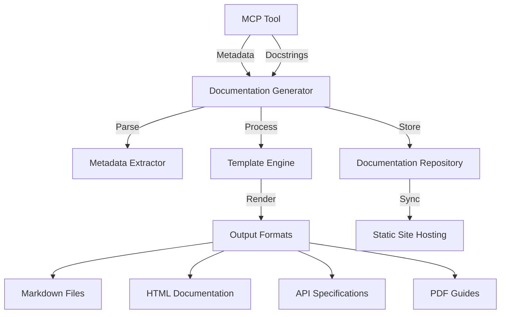

# Documentation Generator Module

## 📚 Overview

The Documentation Generator Module automatically creates comprehensive technical documentation from MCP tool metadata, annotations, and code structure. This ensures that all deployed tools have consistent, up-to-date documentation that follows organizational standards.

### Purpose
- **Automated Documentation**: Generate documentation automatically from code metadata
- **Consistency**: Ensure all tools follow the same documentation structure and style
- **Maintainability**: Reduce manual documentation effort and errors
- **Discoverability**: Make tools easier to understand and use through comprehensive docs

### Key Features
- ✅ Automatic generation from tool decorators and docstrings
- ✅ Support for multiple output formats (Markdown, HTML, PDF, API specs)
- ✅ Template-based customization
- ✅ Integration with catalog metadata
- ✅ Version-aware documentation
- ✅ Search and indexing capabilities

---

## 🏗️ Architecture

### Component Diagram



### Data Flow

1. **Metadata Extraction**: Extract documentation from tool decorators, docstrings, and type hints
2. **Content Processing**: Process extracted content, apply templates, and generate structured documentation
3. **Format Rendering**: Render documentation in multiple formats (Markdown, HTML, etc.)
4. **Storage**: Store generated documentation in version-controlled repository
5. **Publishing**: Publish documentation to static sites or documentation portals

### Integration Points

- **Tool Registration Module**: For accessing tool metadata
- **Catalog Integration**: For retrieving registered tool information
- **Azure Static Web Apps**: For hosting generated documentation
- **Azure DevOps Wiki**: For team documentation
- **GitHub/GitLab**: For version-controlled documentation

---

## 🚀 Quick Start

### Automatic Documentation Generation

The Documentation Generator works automatically when you use the framework's tool decorators with proper docstrings:

```python
from platform.framework import tool
from platform.catalog import Classification, SLATier

@tool(
    name="GetDonorPortfolioHealth",
    description="Retrieves comprehensive health metrics for donor portfolios",
    classification=Classification.CONFIDENTIAL,
    sla_tier=SLATier.GOLD,
    owner="DER",
    domain="DonorManagement"
)
def get_donor_portfolio_health(donor_id: str, time_range: str = "30d") -> dict:
    """
    Retrieves comprehensive health metrics for a donor portfolio.
    
    This tool provides detailed analysis of donor portfolio health, including
    risk scores, performance trends, and compliance status. It's designed for
    use by donor analysts and portfolio managers.
    
    Args:
        donor_id (str): Unique donor identifier in UUID format.
            Example: "123e4567-e89b-12d3-a456-426614174000"
        time_range (str, optional): Time range for analysis. Defaults to "30d".
            Supported values: "7d", "30d", "90d", "1y"
            
    Returns:
        dict: Dictionary containing:
            - health_score (float): Overall health score (0-100)
            - risk_score (float): Risk assessment score (0-100)
            - trends (list): Performance trends over time
            - compliance (dict): Compliance status by category
            - recommendations (list): Actionable recommendations
            
    Raises:
        DonorNotFoundError: If the specified donor does not exist
        AccessDeniedError: If the caller lacks required permissions
        InvalidParameterError: If donor_id is not in UUID format
        
    Examples:
        >>> get_donor_portfolio_health("123e4567-e89b-12d3-a456-426614174000")
        {
            'health_score': 85.5,
            'risk_score': 15.2,
            'trends': [...],
            'compliance': {...},
            'recommendations': [...]
        }
        
        >>> get_donor_portfolio_health(
        ...     "123e4567-e89b-12d3-a456-426614174000",
        ...     time_range="90d"
        ... )
    
    Notes:
        - Requires 'donor.read' permission
        - Data classification: CONFIDENTIAL
        - SLA: Gold (response within 1 hour)
        - Rate limited to 100 requests per minute
    """
    # Implementation here
    pass
```

### Manual Generation

For on-demand documentation generation:

```python
from platform.docs import DocumentationGenerator, OutputFormat

# Create generator
generator = DocumentationGenerator()

# Generate documentation for a specific tool
generator.generate_tool_docs(
    tool_name="GetDonorPortfolioHealth",
    output_formats=[OutputFormat.MARKDOWN, OutputFormat.HTML],
    output_dir="./docs/generated"
)

# Generate documentation for entire domain
generator.generate_domain_docs(
    domain="DonorManagement",
    output_formats=[OutputFormat.MARKDOWN],
    output_dir="./docs/domains"
)
```

---

## ⚙️ Configuration

### Environment Variables

| Variable | Description | Required | Default |
|----------|-------------|----------|---------|
| `DOCS_OUTPUT_DIR` | Base directory for generated documentation | ❌ | `./docs/generated` |
| `DOCS_TEMPLATE_DIR` | Directory containing documentation templates | ❌ | `./templates/docs` |
| `DOCS_STATIC_SITE_URL` | URL for static site hosting | ❌ | - |
| `DOCS_VERSION` | Documentation version | ❌ | `1.0.0` |
| `DOCS_LANGUAGE` | Default documentation language | ❌ | `en` |

### Configuration File (`config/docs.yaml`)

```yaml
documentation:
  # Output settings
  output:
    dir: "./docs/generated"
    formats:
      - markdown
      - html
      - pdf
    
    # Format-specific settings
    markdown:
      enabled: true
      extensions:
        - tables
        - fenced_code
        - footnotes
      
    html:
      enabled: true
      template: "default.html"
      css: "styles.css"
      
    pdf:
      enabled: false
      template: "report.tex"
      
  # Template settings
  templates:
    dir: "./templates/docs"
    tool_template: "tool.md.j2"
    domain_template: "domain.md.j2"
    index_template: "index.md.j2"
    api_spec_template: "openapi.yaml.j2"
    
  # Content settings
  content:
    include_private: false
    include_examples: true
    include_source: false
    max_code_length: 100
    
  # Versioning
  versioning:
    enabled: true
    strategy: "semver"
    versions_to_keep: 5
    
  # Publishing
  publishing:
    static_site:
      enabled: true
      url: "https://docs.unhcr.org/mcp"
      branch: "main"
      
    azure_static_web_app:
      enabled: false
      resource_group: "mcp-docs-rg"
      app_name: "mcp-documentation"
      
  # Integration
  integration:
    catalog:
      enabled: true
      sync_on_generate: true
      
    git:
      enabled: true
      commit_message: "Update generated documentation"
      author: "Documentation Bot <docs@unhcr.org>"
```

### Template Configuration

Create custom templates in the templates directory:

```bash
templates/docs/
├── tool.md.j2              # Individual tool documentation
├── domain.md.j2            # Domain overview documentation
├── index.md.j2             # Main index page
├── api_spec.yaml.j2        # OpenAPI specification
├── navigation.md.j2        # Navigation structure
└── styles.css              # HTML styling
```

---

## 🔧 API Reference

### DocumentationGenerator Class

#### `generate_tool_docs(tool_name: str, output_formats: List[OutputFormat], output_dir: str = None) -> Dict[str, str]`

Generate documentation for a specific tool.

**Parameters:**
- `tool_name` (str): Name of the tool to document
- `output_formats` (List[OutputFormat]): List of output formats to generate
- `output_dir` (str, optional): Output directory. Defaults to configured directory.

**Returns:**
- `Dict[str, str]`: Dictionary mapping format names to generated file paths

**Example:**
```python
generator = DocumentationGenerator()
results = generator.generate_tool_docs(
    tool_name="GetDonorPortfolioHealth",
    output_formats=[OutputFormat.MARKDOWN, OutputFormat.HTML]
)
# results = {
#     "markdown": "./docs/generated/GetDonorPortfolioHealth.md",
#     "html": "./docs/generated/GetDonorPortfolioHealth.html"
# }
```

#### `generate_domain_docs(domain: str, output_formats: List[OutputFormat], output_dir: str = None) -> Dict[str, List[str]]`

Generate documentation for all tools in a domain.

**Parameters:**
- `domain` (str): Domain name
- `output_formats` (List[OutputFormat]): List of output formats
- `output_dir` (str, optional): Output directory

**Returns:**
- `Dict[str, List[str]]`: Dictionary mapping format names to lists of generated file paths

#### `generate_all_docs(output_formats: List[OutputFormat], output_dir: str = None) -> Dict[str, List[str]]`

Generate documentation for all registered tools.

#### `generate_api_spec(domain: str = None, output_path: str = None) -> str`

Generate OpenAPI specification for tools.

**Parameters:**
- `domain` (str, optional): Specific domain to include. If None, includes all domains.
- `output_path` (str, optional): Output file path

**Returns:**
- `str`: Path to generated OpenAPI specification file

**Example:**
```python
# Generate OpenAPI spec for DonorManagement domain
generator.generate_api_spec(
    domain="DonorManagement",
    output_path="./docs/api/donor-management.yaml"
)
```

#### `generate_index(output_path: str = None) -> str`

Generate main index documentation with links to all tools.

#### `publish_to_static_site(message: str = None) -> bool`

Publish generated documentation to static site hosting.

**Parameters:**
- `message` (str, optional): Commit message for the publish

**Returns:**
- `bool`: True if publish was successful

### OutputFormat Enum

```python
class OutputFormat(Enum):
    MARKDOWN = "markdown"
    HTML = "html"
    PDF = "pdf"
    OPENAPI = "openapi"
    JSON = "json"
```

### DocumentationMetadata Class

```python
@dataclass
class DocumentationMetadata:
    tool_name: str
    tool_description: str
    domain: str
    owner: str
    version: str
    classification: Classification
    sla_tier: SLATier
    parameters: List[ParameterMetadata]
    returns: str
    raises: List[str]
    examples: List[str]
    notes: List[str]
    tags: List[str]
    
    # Generated fields
    generated_at: datetime
    documentation_version: str
    
    # Source information
    source_file: str
    source_line: int
    
    # Cross-references
    related_tools: List[str]
    dependencies: List[str]
```

---

## 🎯 Best Practices

### ⭐ Comprehensive Docstrings

**Always provide detailed docstrings with all relevant information:**

```python
# ✅ GOOD - Comprehensive docstring
def get_donor_portfolio_health(donor_id: str, time_range: str = "30d") -> dict:
    """
    Retrieves comprehensive health metrics for a donor portfolio.
    
    This tool provides detailed analysis of donor portfolio health, including
    risk scores, performance trends, and compliance status. It's designed for
    use by donor analysts and portfolio managers.
    
    Args:
        donor_id (str): Unique donor identifier in UUID format.
            Example: "123e4567-e89b-12d3-a456-426614174000"
        time_range (str, optional): Time range for analysis. Defaults to "30d".
            Supported values: "7d", "30d", "90d", "1y"
            
    Returns:
        dict: Dictionary containing health metrics, risk scores, and trends
            
    Raises:
        DonorNotFoundError: If the specified donor does not exist
        AccessDeniedError: If the caller lacks required permissions
        
    Examples:
        >>> get_donor_portfolio_health("123e4567-e89b-12d3-a456-426614174000")
        
    Notes:
        - Requires 'donor.read' permission
        - Data classification: CONFIDENTIAL
    """

# ❌ BAD - Minimal docstring
def get_donor_portfolio_health(donor_id: str) -> dict:
    """Gets donor portfolio health"""
```

### ⭐ Type Hints

**Always use type hints for better documentation:**

```python
# ✅ GOOD - With type hints
def get_donor_profile(
    donor_id: str,
    include_history: bool = False,
    fields: List[str] = None
) -> Dict[str, Any]:
    """Retrieves donor profile information"""

# ❌ BAD - Without type hints
def get_donor_profile(donor_id, include_history=False, fields=None):
    """Retrieves donor profile information"""
```

### ⭐ Examples in Documentation

**Include practical examples in your docstrings:**

```python
# ✅ GOOD - With examples
def calculate_donor_score(donor_id: str, criteria: List[str] = None) -> float:
    """
    Calculates a composite score for a donor based on multiple criteria.
    
    Examples:
        >>> calculate_donor_score("123e4567-e89b-12d3-a456-426614174000")
        85.5
        
        >>> calculate_donor_score(
        ...     "123e4567-e89b-12d3-a456-426614174000",
        ...     criteria=["loyalty", "contribution_frequency"]
        ... )
        92.3
    """

# ❌ BAD - Without examples
def calculate_donor_score(donor_id: str, criteria: List[str] = None) -> float:
    """Calculates a composite score for a donor"""
```

### ⭐ Cross-References

**Reference related tools and concepts:**

```python
# ✅ GOOD - With cross-references
def get_donor_contributions(donor_id: str) -> List[Dict]:
    """
    Retrieves contribution history for a donor.
    
    See Also:
        - get_donor_profile: For basic donor information
        - calculate_donor_score: For donor scoring
        - get_donor_portfolio_health: For portfolio health metrics
        
    Notes:
        This tool complements get_donor_profile by providing detailed
        contribution information. Use calculate_donor_score for scoring.
    """
```

### ⭐ Version Documentation

**Document breaking changes and version history:**

```python
@tool(
    name="GetDonorPortfolioHealth",
    version="2.1.0",
    changelog="""
    Version History:
        2.1.0 (2026-05-01): Added time_range parameter
        2.0.0 (2026-04-01): Breaking change - response format updated
        1.1.0 (2026-03-15): Added risk_score to response
        1.0.0 (2026-03-01): Initial release
    """
)
def get_donor_portfolio_health(donor_id: str, time_range: str = "30d") -> dict:
    """Retrieves donor portfolio health metrics"""
```

---

## 🔍 Troubleshooting

### Common Issues

#### Documentation Not Generated

**Symptom:** No documentation files are created

**Solution:** Check configuration and permissions:

```python
# Verify configuration
generator = DocumentationGenerator()
config = generator.get_config()
print(f"Output directory: {config.output_dir}")
print(f"Enabled formats: {config.enabled_formats}")

# Check if tool exists
if not generator.catalog.tool_exists("GetDonorPortfolioHealth"):
    print("Tool not found in catalog")
```

#### Template Errors

**Symptom:** `TemplateError: Undefined variable 'parameter'`

**Solution:** Check template syntax and available variables:

```python
# List available template variables
metadata = generator.get_tool_metadata("GetDonorPortfolioHealth")
print(f"Available fields: {dir(metadata)}")

# Validate template
generator.validate_template("tool.md.j2")
```

#### Missing Dependencies

**Symptom:** `ImportError: No module named 'markdown'`

**Solution:** Install required dependencies:

```bash
# For Markdown generation
pip install markdown

# For HTML generation
pip install markdown jinja2

# For PDF generation
pip install weasyprint

# For OpenAPI generation
pip install pyyaml
```

#### Permission Issues

**Symptom:** `PermissionError: Cannot write to output directory`

**Solution:** Ensure proper permissions:

```python
import os

output_dir = "./docs/generated"
if not os.path.exists(output_dir):
    os.makedirs(output_dir, exist_ok=True)
    
# Set appropriate permissions
os.chmod(output_dir, 0o755)
```

---

## 📊 Monitoring and Metrics

### Documentation Metrics

The module exposes the following metrics:

| Metric | Description | Target |
|--------|-------------|--------|
| `docs.generation.success` | Successful documentation generations | > 99% |
| `docs.generation.failure` | Failed documentation generations | < 1% |
| `docs.generation.latency` | Generation latency by format | < 5s |
| `docs.tools.documented` | Number of documented tools | - |
| `docs.tools.undocumented` | Number of undocumented tools | 0 |
| `docs.version.coverage` | Percentage of tools with up-to-date docs | > 95% |

### Azure Monitor Integration

```python
from platform.telemetry import metrics

# Track generation metrics
metrics.increment("docs.generation.success", tags=["format:markdown"])
metrics.increment("docs.generation.failure", tags=["reason:template_error"])

# Track latency
with metrics.timer("docs.generation.latency", tags=["format:html"]):
    generator.generate_tool_docs("MyTool", [OutputFormat.HTML])
```

---

## 🔒 Security Considerations

### Sensitive Information

**Never include sensitive information in documentation:**

```python
# ✅ GOOD - No sensitive info
def get_donor_data(donor_id: str) -> dict:
    """
    Retrieves donor data.
    
    Note: This tool requires appropriate permissions and
    handles data according to CONFIDENTIAL classification.
    """

# ❌ BAD - Contains sensitive info
def get_donor_data(donor_id: str) -> dict:
    """
    Retrieves donor data.
    
    Note: Uses connection string 'Server=...;Password=secret123'
    """
```

### Access Control

**Documentation access respects classification:**

- PUBLIC tools: Documentation accessible to all
- INTERNAL tools: Documentation accessible to authenticated users
- CONFIDENTIAL tools: Documentation accessible to authorized users only
- STRICTLY_CONFIDENTIAL tools: Documentation accessible to specific roles only

### Documentation Review

**Implement documentation review process:**

```python
from platform.docs import DocumentationReviewer

reviewer = DocumentationReviewer()

# Review documentation for sensitive content
issues = reviewer.review_tool_docs("GetDonorPortfolioHealth")

if issues:
    print(f"Found {len(issues)} issues:")
    for issue in issues:
        print(f"  - {issue.type}: {issue.description}")
        print(f"    Location: {issue.location}")
        print(f"    Severity: {issue.severity}")
```

---

## 🔄 Integration with Other Modules

### Catalog Integration

Documentation generator uses catalog metadata:

```python
from platform.catalog import CatalogClient
from platform.docs import DocumentationGenerator

# Get catalog client
catalog = CatalogClient()

# Get documentation generator
generator = DocumentationGenerator(catalog)

# Generate docs using catalog metadata
metadata = catalog.get_tool("GetDonorPortfolioHealth")
generator.generate_from_metadata(metadata)
```

### Tool Registration Module

Documentation is generated automatically on tool registration:

```python
from platform.framework import tool

@tool(
    name="MyTool",
    auto_document=True,  # Automatically generate docs
    doc_output_formats=["markdown", "html"]
)
def my_tool():
    pass
```

### Telemetry Module

All documentation operations generate telemetry:

```json
{
  "tool": "DocumentationGenerator",
  "operation": "generate_tool_docs",
  "domain": "Documentation",
  "duration_ms": 250,
  "status": "Success",
  "metadata": {
    "tool_name": "GetDonorPortfolioHealth",
    "output_formats": ["markdown", "html"],
    "file_count": 2
  }
}
```

---

## 📝 Examples

### Complete Documentation Example

```python
from platform.framework import tool
from platform.catalog import Classification, SLATier, ParameterMetadata
from platform.auth import authenticated_tool, requires_permission
from platform.telemetry import instrumented

@authenticated_tool
@requires_permission("donor.read")
@instrumented
@tool(
    name="GetDonorPortfolioHealth",
    description="Retrieves comprehensive health metrics for donor portfolios",
    classification=Classification.CONFIDENTIAL,
    sla_tier=SLATier.GOLD,
    owner="DER",
    domain="DonorManagement",
    version="2.1.0",
    tags=["donor", "portfolio", "analytics", "health"],
    auto_document=True,
    doc_output_formats=["markdown", "html", "openapi"],
    changelog="""
    Version History:
        2.1.0 (2026-05-01): Added time_range parameter
        2.0.0 (2026-04-01): Breaking change - response format updated
        1.1.0 (2026-03-15): Added risk_score to response
        1.0.0 (2026-03-01): Initial release
    """
)
def get_donor_portfolio_health(
    donor_id: str,
    time_range: str = "30d",
    include_details: bool = False
) -> Dict[str, Any]:
    """
    Retrieves comprehensive health metrics for a donor portfolio.
    
    This tool provides detailed analysis of donor portfolio health, including
    risk scores, performance trends, and compliance status. It's designed for
    use by donor analysts and portfolio managers to assess the overall health
    and identify potential issues or opportunities.
    
    The health score is calculated based on multiple factors including:
    - Contribution frequency and consistency
    - Response to campaigns and appeals
    - Compliance with reporting requirements
    - Risk assessment based on external factors
    
    Args:
        donor_id (str): Unique donor identifier in UUID format.
            Must be a valid UUID string.
            Example: "123e4567-e89b-12d3-a456-426614174000"
            
        time_range (str, optional): Time range for analysis. Defaults to "30d".
            Supported values: "7d", "30d", "90d", "1y", "max"
            The "max" value retrieves all available historical data.
            
        include_details (bool, optional): Whether to include detailed breakdown.
            Defaults to False. When True, includes additional metrics and
            detailed analysis by category.
            
    Returns:
        Dict[str, Any]: Dictionary containing:
            - health_score (float): Overall health score (0-100)
            - risk_score (float): Risk assessment score (0-100)
            - confidence (float): Confidence level in the scores (0-1)
            - trends (List[Dict]): Performance trends over time
                - date (str): ISO 8601 date string
                - health_score (float): Health score for this date
                - risk_score (float): Risk score for this date
            - compliance (Dict[str, bool]): Compliance status by category
                - reporting: Whether reporting requirements are met
                - documentation: Whether required documentation is complete
                - audit: Whether audit requirements are satisfied
            - recommendations (List[Dict]): Actionable recommendations
                - category (str): Recommendation category
                - priority (str): Priority level (low, medium, high, critical)
                - description (str): Detailed recommendation
                - impact (str): Expected impact of implementing the recommendation
            
            If include_details=True, also includes:
            - detailed_metrics (Dict): Detailed metrics by category
            - historical_data (List): Complete historical data
            
    Raises:
        DonorNotFoundError: If the specified donor does not exist in the system.
            Error code: DONOR-001
            
        AccessDeniedError: If the caller lacks the required 'donor.read' permission.
            Error code: AUTH-002
            
        InvalidParameterError: If donor_id is not a valid UUID or time_range
            is not a supported value.
            Error code: VALIDATION-001
            
        RateLimitExceededError: If the request rate limit is exceeded.
            Error code: RATE-001
            
    Examples:
        Basic usage:
        
        >>> get_donor_portfolio_health("123e4567-e89b-12d3-a456-426614174000")
        {
            'health_score': 85.5,
            'risk_score': 15.2,
            'confidence': 0.95,
            'trends': [...],
            'compliance': {'reporting': True, 'documentation': True, 'audit': True},
            'recommendations': [...]
        }
        
        With custom time range:
        
        >>> get_donor_portfolio_health(
        ...     "123e4567-e89b-12d3-a456-426614174000",
        ...     time_range="90d"
        ... )
        
        With detailed breakdown:
        
        >>> get_donor_portfolio_health(
        ...     "123e4567-e89b-12d3-a456-426614174000",
        ...     include_details=True
        ... )
    
    Notes:
        - This tool has a Gold SLA with guaranteed response within 1 hour
        - Data is classified as CONFIDENTIAL and must be handled accordingly
        - The health score algorithm is proprietary and may change between versions
        - For best results, use the most recent time_range that meets your needs
        - Rate limited to 100 requests per minute per caller
        
    See Also:
        - get_donor_profile: For basic donor information
        - get_donor_contributions: For contribution history
        - calculate_donor_score: For donor scoring
        - get_donor_risk_assessment: For detailed risk assessment
    """
    # Implementation here
    pass
```

### Domain Documentation Generation

```python
from platform.docs import DocumentationGenerator, OutputFormat

def generate_donor_management_docs():
    generator = DocumentationGenerator()
    
    # Generate documentation for all DonorManagement tools
    results = generator.generate_domain_docs(
        domain="DonorManagement",
        output_formats=[OutputFormat.MARKDOWN, OutputFormat.HTML],
        output_dir="./docs/domains/donor-management"
    )
    
    print(f"Generated documentation for DonorManagement domain:")
    for fmt, files in results.items():
        print(f"  {fmt.upper()}:")
        for file_path in files:
            print(f"    - {file_path}")
    
    # Generate domain index
    index_path = generator.generate_domain_index(
        domain="DonorManagement",
        output_path="./docs/domains/donor-management/README.md"
    )
    print(f"  Index: {index_path}")
    
    # Generate OpenAPI spec
    api_spec_path = generator.generate_api_spec(
        domain="DonorManagement",
        output_path="./docs/api/donor-management.yaml"
    )
    print(f"  API Spec: {api_spec_path}")
```

### Custom Template Example

Create a custom template file `templates/docs/tool.md.j2`:

```jinja2
# {{ tool_name }}

**Version:** {{ version }}  
**Domain:** {{ domain }}  
**Owner:** {{ owner }}  
**Classification:** {{ classification }}  
**SLA Tier:** {{ sla_tier }}  

## 📝 Description

{{ tool_description }}

## 🔧 Parameters


| Parameter | Type | Required | Default | Description |
|-----------|------|----------|---------|-------------|

| `{{ param.name }}` | {{ param.type }} | ✅❌ | {{ param.default | default("") }} | {{ param.description | default("") }} |


No parameters.


## 📤 Returns

{{ returns | default("No return value") }}

## ⚠️ Raises


- 
  - `{{ error }}`
  

No exceptions raised.


## 📋 Examples



```python
{{ example }}
```


No examples available.


## 📝 Notes



- {{ note }}
  

No additional notes.


## 🔗 See Also


- 
  - [{{ tool }}](./{{ tool | lower | replace(" ", "-") }}.md)
  

No related tools.


---

*Generated: {{ generated_at | datetimeformat("%Y-%m-%d %H:%M:%S") }}*  
*Documentation Version: {{ documentation_version }}*
```

---

## 📚 Additional Resources

- [Markdown Documentation](https://daringfireball.net/projects/markdown/)
- [Jinja2 Templating](https://jinja.palletsprojects.com/)
- [OpenAPI Specification](https://spec.openapis.org/oas/v3.1.0)
- [WeasyPrint for PDF](https://weasyprint.org/)
- [MCP Framework Architecture](../architecture/components.md)
- [Catalog Integration Module](./catalog-integration.md)

---

## 🔄 Changelog

| Version | Date | Changes |
|---------|------|---------|
| 1.0.0 | 2026-05-01 | Initial release |
| 1.1.0 | 2026-05-15 | Added OpenAPI specification generation |
| 1.2.0 | 2026-06-01 | Added PDF generation support |
| 1.3.0 | 2026-06-15 | Added custom template support |
