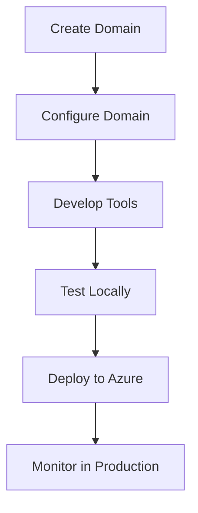

# 🏭 Domain Templates

The Domain Templates section provides comprehensive guidance on creating new MCP domain repositories using the MCP Platform Framework template system. This enables consistent, standardized domain development across the organization.

## 🎯 Overview

The MCP Platform Framework provides a template system that allows you to quickly create new domain repositories with all the necessary structure, configuration, and boilerplate code already in place. This ensures:

- **Consistency**: All domains follow the same structure and patterns
- **Speed**: New domains can be created in minutes, not days
- **Quality**: Built-in best practices and framework integration
- **Compliance**: Automatic inclusion of security, telemetry, and audit capabilities

## 📖 Templates Documentation

### [Template System Overview](overview.md)
Understand the template system architecture, components, and how it works.

### [Creating New Domains](creating-domains.md)
Step-by-step guide to creating new domain repositories from the template.

### [Template Configuration](configuration.md)
Configure the template system for your organization's specific needs.

### [Domain Structure](structure.md)
Detailed explanation of the standard domain repository structure.

## 🚀 Quick Start

### Create a New Domain

```bash
# 1. Use the template generator
python -m platform.template.template_generator \
    --domain DonorManagement \
    --output ./mcp-donor-management \
    --description "Domain for managing donor information and portfolios" \
    --owner "DER" \
    --classification "CONFIDENTIAL"

# 2. Navigate to the new domain
cd mcp-donor-management

# 3. Install dependencies
pip install -r requirements.txt

# 4. Configure the domain
# Edit config/domain.yaml with your specific configuration

# 5. Start developing tools
# Add your tool functions in the tools/ directory
```

### Domain Development Workflow



## 🏗️ Template Features

### Standard Structure
Every domain created from the template includes:

```
mcp-xxx-domain/
├── tools/                    # MCP tool implementations
│   ├── __init__.py
│   ├── donor_tools.py       # Example domain-specific tools
│   └── ...
├── semantic_models/          # Semantic model access
│   ├── __init__.py
│   └── models.py            # Semantic model definitions
├── tests/                    # Test suite
│   ├── unit/
│   ├── integration/
│   └── conftest.py
├── docs/                     # Domain-specific documentation
│   ├── README.md
│   └── api-reference.md
├── config/                   # Configuration files
│   ├── domain.yaml
│   ├── authentication.yaml
│   ├── authorization.yaml
│   └── ...
├── metadata/                 # Domain metadata
│   ├── catalog.json         # Catalog registration metadata
│   └── governance.json      # Governance and compliance metadata
├── pipelines/                # CI/CD pipeline definitions
│   └── azure-devops.yml
├── platform_framework/       # Platform framework integration
│   └── __init__.py
├── main.py                   # Azure Function entry point
├── requirements.txt          # Python dependencies
├── pyproject.toml           # Project configuration
└── README.md                 # Domain-specific README
```

### Built-in Capabilities

Every domain automatically includes:

- **Authentication**: Entra ID integration with JWT validation
- **Authorization**: RBAC with permission decorators
- **Telemetry**: Automatic Application Insights integration
- **Audit Logging**: Compliance logging to Azure Blob Storage
- **Error Handling**: Standard error structures and handling
- **Data Classification**: Framework controls for data governance
- **Tool Registration**: Automatic MCP tool discovery and registration
- **Fabric Connectivity**: Standardized Fabric service access
- **Configuration Management**: Environment-aware configuration
- **Key Vault Integration**: Secure secrets management

## 🎯 Template Benefits

### For Domain Developers

✅ **Focus on Business Logic**: Spend time on domain-specific functionality, not infrastructure
✅ **Consistent Patterns**: Follow established patterns that work across the organization
✅ **Built-in Best Practices**: Security, performance, and reliability built-in from the start
✅ **Automatic Compliance**: Data classification, audit logging, and governance automatically included

### For Platform Administrators

✅ **Standardized Deployments**: All domains deploy the same way
✅ **Consistent Monitoring**: All domains emit the same telemetry and metrics
✅ **Simplified Governance**: All domains follow the same governance policies
✅ **Easier Maintenance**: Common infrastructure is managed centrally

### For the Organization

✅ **Faster Time to Market**: New domains can be developed and deployed quickly
✅ **Reduced Risk**: Consistent security and compliance across all domains
✅ **Improved Quality**: Built-in testing and monitoring ensure high quality
✅ **Better Collaboration**: Common patterns make it easier for teams to work together

## 📁 Template Organization

```
templates/
├── domain/                    # Main domain template
│   ├── tools/
│   ├── semantic_models/
│   ├── tests/
│   ├── docs/
│   ├── config/
│   ├── metadata/
│   ├── pipelines/
│   └── platform_framework/
├── partials/                  # Reusable template partials
│   ├── auth/
│   ├── telemetry/
│   ├── audit/
│   └── ...
├── generators/                # Template generators
│   ├── domain_generator.py
│   └── ...
└── README.md
```

## ⭐ Best Practices for Using Templates

### Domain Design

✅ **Single Responsibility**: Each domain should have a single, well-defined responsibility
✅ **Clear Boundaries**: Domains should have clear boundaries with other domains
✅ **Minimal Dependencies**: Minimize dependencies between domains
✅ **Consistent Naming**: Use consistent naming conventions across all domains

### Tool Development

✅ **Use Decorators**: Always use framework decorators for cross-cutting concerns
✅ **Follow Naming Conventions**: Use consistent naming for tools and operations
✅ **Include Documentation**: Document all tools with clear descriptions and examples
✅ **Handle Errors Gracefully**: Implement proper error handling in all tools

### Configuration Management

✅ **Environment-Specific Config**: Use separate configurations for dev, test, and prod
✅ **Secure Secrets**: Never hardcode secrets - always use Key Vault
✅ **Version Control**: Keep configuration files in version control
✅ **Document Changes**: Document all configuration changes

## 🔍 Troubleshooting

### Common Issues

**Template generation fails**
- Verify that all required parameters are provided
- Check that the output directory doesn't already exist
- Ensure you have write permissions in the target directory

**Domain doesn't deploy**
- Verify that all required configuration is in place
- Check that all dependencies are installed
- Ensure the Azure resources are properly configured

**Tools aren't discovered**
- Verify that tools are decorated with `@tool` decorator
- Check that tools are in the correct directory (tools/)
- Ensure there are no syntax errors in the tool files

## 📚 Related Documentation

- [Template System Overview](overview.md) - Template architecture and components
- [Creating New Domains](creating-domains.md) - Step-by-step domain creation guide
- [Template Configuration](configuration.md) - Template customization and configuration
- [Domain Structure](structure.md) - Standard domain repository structure
- [Getting Started](../getting-started/README.md) - General getting started guide
- [Architecture](../architecture/README.md) - Framework architecture overview

---

**🎉 Ready to create a new domain?** Start with the [Creating New Domains](creating-domains.md) guide for a step-by-step walkthrough.

**Need more details?** Check the [Template System Overview](overview.md) for comprehensive information about the template system.